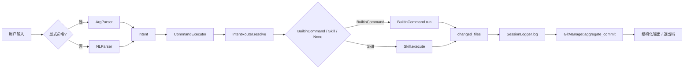
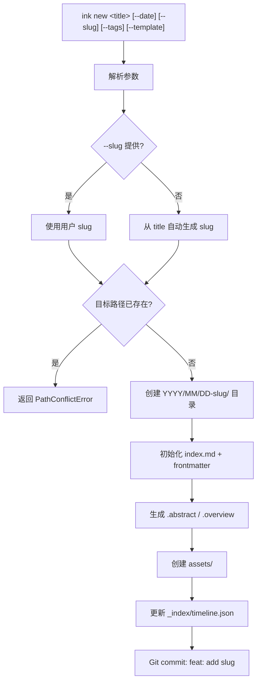

# 设计文档

## 概述

Ink Blog Core（Phase 1）将现有的两个独立 Python CLI 脚本（`ink`、`ink-v2`）重构为一个模块化、可扩展的 Python 包 `ink_core`。系统遵循 FS-as-DB 哲学，以文件系统为唯一数据存储，通过 CLI 意图路由驱动 Skills 执行。

Phase 1 聚焦四个核心能力：CLI 框架（含 `ink new` 文章创建）、三层上下文（L0/L1/L2）、基础 Skills（publish/analyze/search）、Git 集成。架构预留 Agent/Orchestrator 扩展接口但不实现。

### 关键设计决策

| 决策 | 选择 | 理由 |
|------|------|------|
| AI 模型接入 | 可配置（本地 Ollama + 云端 API），Phase 1 默认规则引擎 | 降低外部依赖，后续可插拔 |
| 发布渠道深度 | Phase 1 通过 PublisherAdapter 接口输出本地格式化文件，不调用真实 API | 先验证格式转换逻辑，Phase 2 接入远程 adapter |
| 自然语言解析 | 规则匹配优先，LLM 作为可选兜底 | 确定性优先，减少延迟 |
| 包管理 | 单一 `ink_core` Python 包，`ink` 作为入口点 | 统一 v1/v2，pip 可安装 |
| 并发模型 | Phase 1 单进程同步，预留 async 接口 | 简单可靠，后续扩展 |
| Article 唯一标识 | Canonical ID = `YYYY/MM/DD-slug`（不含末尾斜杠） | 路径即 ID，全局统一引用键 |
| 派生文件策略 | `.abstract`/`.overview` 为系统派生文件，rebuild 全量覆盖 | 可重建优先，Phase 1 不区分人工/系统区 |
| 发布记录存储 | 分渠道记录存于 `.ink/publish-history/` | 与 Article frontmatter 解耦，便于查询 |
| Git 提交粒度 | 单次 ink 命令聚合为一次 commit（由 CommandExecutor 统一触发） | 原子性，减少噪音提交 |
| 发布状态来源 | 发布门控读 `index.md` frontmatter，`.overview.status` 为派生字段 | 保持 Source of Truth 一致性 |
| 命令执行事务 | CommandExecutor 统一协调 session/changed_files/git commit/错误输出 | 横切关注点集中管理 |

---

## 架构

### 整体架构

```
┌─────────────────────────────────────────────────┐
│                   ink CLI                        │
│  ┌───────────┐  ┌──────────────┐  ┌──────────┐ │
│  │ ArgParser │  │ IntentRouter │  │ NLParser │ │
│  └─────┬─────┘  └──────┬───────┘  └────┬─────┘ │
│        └───────────────┼────────────────┘       │
│                        ▼                         │
│              ┌─────────────────┐                 │
│              │  SkillRegistry  │                 │
│              └────────┬────────┘                 │
│        ┌──────────────┼──────────────┐          │
│        ▼              ▼              ▼          │
│  ┌──────────┐  ┌──────────┐  ┌──────────┐     │
│  │ Publish  │  │ Analyze  │  │  Search  │     │
│  │  Skill   │  │  Skill   │  │  Skill   │     │
│  └────┬─────┘  └────┬─────┘  └────┬─────┘     │
│       └──────────────┼──────────────┘           │
│                      ▼                           │
│  ┌──────────────────────────────────────────┐   │
│  │            Core Services                  │   │
│  │  ┌────────────┐ ┌──────┐ ┌────────────┐ │   │
│  │  │ FileSystem │ │ Git  │ │  Session   │ │   │
│  │  │ (L0/L1/L2) │ │ Mgr  │ │  Logger    │ │   │
│  │  └────────────┘ └──────┘ └────────────┘ │   │
│  │  ┌─────────────────┐ ┌───────────────┐  │   │
│  │  │ PublishHistory  │ │  SlugResolver │  │   │
│  │  │    Manager      │ │               │  │   │
│  │  └─────────────────┘ └───────────────┘  │   │
│  └──────────────────────────────────────────┘   │
└─────────────────────────────────────────────────┘
                       │
                       ▼
            ┌─────────────────────────┐
            │   File System           │
            │  (Workspace Root)       │
            │  <current-project>/     │
            └─────────────────────────┘

全局配置位于 `~/.ink/config.yaml`；
Workspace 数据位于当前项目根目录下，包括 `.ink/`、`_index/` 与 Article 目录树（`YYYY/MM/DD-slug/`）。
```

### 数据流



### ink new 创建流程



### 扩展预留

为后续 Agent 系统预留的接口（Phase 1 不实现）：

- `SkillRegistry` 支持动态注册，后续 Agent 可注入自定义 Skills
- `Session` 日志格式兼容未来的 episodic memory
- `FileSystem` 抽象层支持后续加入 Git Branch 并发控制
- CLI 入口支持 `--agent` 模式切换

---

## 组件与接口

### 0. 命令执行事务层 (`ink_core/core/executor.py`)

CommandExecutor 是单次 `ink` 命令的事务协调器，负责所有横切关注点：

```python
# ink_core/core/executor.py
@dataclass
class ExecutionContext:
    session_id: str          # 唯一标识，格式 YYYYMMDD-HHMMSS-<action>-<hash>
    command: str             # 执行的命令名称
    target: str | None       # 目标（Canonical ID 或保留值 workspace/all/system）
    params: dict             # 命令参数
    changed_files: list[Path]  # 本次操作累积的变更文件
    warnings: list[str]      # 执行过程中的警告信息
    started_at: datetime     # 命令开始时间

class CommandExecutor:
    """单次 ink 命令的事务协调器"""
    def execute(self, intent: Intent) -> int:
        """
        职责：
        1. 创建 ExecutionContext（含 session_id）
        2. 调用 IntentRouter.resolve() 获取路由目标，再调用 Skill.execute / BuiltinCommand.run
        3. 聚合 changed_files（从 SkillResult 收集）
        4. 命令结束时统一写入 Session 记录
        5. 若为写命令且 Git 已启用，触发一次聚合 commit
        6. 统一格式化错误输出与退出码（IntentRouter 不返回退出码）
        """
        ...
```

**数据流：**
```
Intent → CommandExecutor.execute()
    ├── 创建 ExecutionContext
    ├── IntentRouter.resolve() → RouteResult（Skill / BuiltinCommand / None）
    ├── Skill.execute() / BuiltinCommand.run() → SkillResult
    ├── 累积 SkillResult.changed_files → context.changed_files
    ├── SessionLogger.log(context, result, duration_ms)
    ├── GitManager.aggregate_commit(context.changed_files, message)
    └── 返回退出码（CommandExecutor 统一负责）
```

### 1. CLI 层 (`ink_core/cli/`)

#### 内置命令 vs Skill 命令边界

| 命令 | 类型 | 说明 |
|------|------|------|
| `new` | BuiltinCommand | 文章创建，直接由 ArticleManager 处理，不走 SkillRegistry |
| `init` | BuiltinCommand | 初始化 Git 仓库，不走 SkillRegistry |
| `skills list` | BuiltinCommand | 列出已注册 Skill，由 SkillRegistry 提供数据，不走 Skill.execute |
| `rebuild` | BuiltinCommand | 全量重建派生文件，直接调用 L0/L1Generator，不走 SkillRegistry |
| `publish` | Skill | 通过 SkillRegistry 注册，走 Skill.execute |
| `analyze` | Skill | 通过 SkillRegistry 注册，走 Skill.execute |
| `search` | Skill | 通过 SkillRegistry 注册，走 Skill.execute |

IntentRouter.resolve() 先检查 BuiltinCommand 表，再查 SkillRegistry，两者不重叠。

```python
# ink_core/cli/parser.py
class InkCLI:
    """CLI 入口，统一 argparse + NLP 路由"""
    def run(self, argv: list[str] | None = None) -> int: ...

# ink_core/cli/intent.py
@dataclass
class Intent:
    action: str          # skill 名称或内置命令
    target: str | None   # 目标路径（使用 Canonical ID）
    params: dict         # 额外参数

class NLParser:
    """自然语言 → Intent 解析器（规则优先）"""
    def parse(self, text: str) -> Intent | None: ...

@dataclass
class RouteResult:
    """路由决策结果"""
    target: "Skill | BuiltinCommand | None"
    error: str | None = None          # 路由失败时的原因
    candidates: list[str] | None = None  # 未匹配时的可用列表

class IntentRouter:
    """将 Intent 路由到对应 Skill 或内置命令（不负责执行，不返回退出码）"""
    def resolve(self, intent: Intent) -> RouteResult: ...
```

### 1b. 内置命令接口 (`ink_core/cli/builtin.py`)

```python
# ink_core/cli/builtin.py
class BuiltinCommand(ABC):
    """内置命令抽象接口，与 Skill 共用 SkillResult，便于 CommandExecutor 统一处理"""
    name: str

    @abstractmethod
    def run(self, target: str | None, params: dict) -> SkillResult: ...
```

### 2. 文件系统层 (`ink_core/fs/`)

```python
# ink_core/fs/article.py
@dataclass
class Article:
    path: Path              # 文章目录绝对路径
    canonical_id: str       # Canonical ID: YYYY/MM/DD-slug（不含末尾斜杠）
    folder_name: str        # 目录名: DD-slug（含日期前缀）
    slug: str               # 纯 slug: liquid-blog（不含日期，用于 frontmatter 和 commit 信息）
    date: str               # 文章日期: YYYY-MM-DD
    l0: str                 # .abstract 内容
    l1: dict                # .overview 解析后的字典（含 summary/key_points 等 section）
    l2: str                 # index.md 原始内容

class ArticleManager:
    """文章 CRUD + 三层上下文管理"""
    def create(self, title: str, *,
               date: str | None = None,
               slug: str | None = None,
               tags: list[str] | None = None,
               template: str = "default") -> Article: ...
    def read(self, path: Path) -> Article: ...
    def update_layers(self, article: Article) -> None: ...
    def list_all(self) -> list[Article]: ...
    def resolve_canonical_id(self, path: Path) -> str: ...

class SlugResolver:
    """Slug 生成与冲突检测"""
    def generate_slug(self, title: str) -> str: ...
    def check_conflict(self, date: str, slug: str) -> bool: ...

# ink_core/fs/layer_generator.py
class L0Generator:
    """生成 .abstract（≤200 字符单行摘要）"""
    def generate(self, content: str) -> str: ...

class L1Generator:
    """生成 .overview（YAML frontmatter + Markdown 章节）"""
    def generate(self, content: str, existing: dict | None = None) -> str:
        """
        existing: 仅用于读取历史元数据（如 created_at），不保留人工修改内容。
        rebuild 时全量覆盖，existing 不是 merge 入口。
        """
        ...

# ink_core/fs/index_manager.py
class IndexManager:
    """维护 _index/ 下的全局索引"""
    def update_timeline(self, article: Article) -> None: ...
    def update_graph(self, graph_data: dict) -> None: ...
    def read_timeline(self) -> list[dict]: ...
    def read_graph(self) -> dict: ...
```

### 3. Skills 层 (`ink_core/skills/`)

```python
# ink_core/skills/base.py
class Skill(ABC):
    """Skill 基类"""
    name: str
    version: str
    context_requirement: str  # "L0" | "L1" | "L2"

    @abstractmethod
    def execute(self, target: str | None, params: dict) -> SkillResult: ...

@dataclass
class SkillResult:
    success: bool
    message: str
    data: dict | None = None
    changed_files: list[Path] | None = None  # 执行层使用 Path 对象，写入 Session JSON 时序列化为字符串

# ink_core/skills/registry.py
class SkillRegistry:
    """Skill 注册与发现"""
    def register(self, skill: Skill) -> None: ...
    def resolve(self, name: str) -> Skill | None: ...
    def list_all(self) -> list[Skill]: ...
    def load_from_directory(self, path: Path) -> None: ...

# ink_core/skills/publish.py
class PublisherAdapter(ABC):
    """发布渠道适配器抽象接口"""
    channel: str
    def publish(self, article: Article, payload: dict) -> ChannelPublishRecord: ...

class BlogFileAdapter(PublisherAdapter):
    """Phase 1: 生成本地 blog 格式文件"""
    channel = "blog"

class NewsletterFileAdapter(PublisherAdapter):
    """Phase 1: 生成本地 newsletter 格式文件"""
    channel = "newsletter"

class MastodonDraftAdapter(PublisherAdapter):
    """Phase 1: 生成本地 mastodon 草稿文件（不调用真实 API）"""
    channel = "mastodon"

class PublishSkill(Skill):
    """发布到多渠道（Phase 1: 通过 adapter 输出本地格式化文件）"""
    SUPPORTED_CHANNELS = ["blog", "newsletter", "mastodon"]
    def execute(self, target: str | None, params: dict) -> SkillResult: ...

# ink_core/skills/analyze.py
@dataclass
class WikiLinkResult:
    """Wiki Link 解析结果"""
    raw: str                    # 原始链接文本
    resolved_id: str | None     # 解析后的 Canonical ID
    status: str                 # "resolved" | "ambiguous" | "unresolved"
    candidates: list[str] | None  # ambiguous 时的候选列表

class AnalyzeSkill(Skill):
    """文章分析与知识图谱"""
    def execute(self, target: str | None, params: dict) -> SkillResult: ...
    def resolve_wiki_link(self, link_text: str, all_articles: list[Article]) -> WikiLinkResult: ...

# ink_core/skills/search.py
@dataclass
class SearchHit:
    """搜索命中结果"""
    canonical_id: str
    title: str
    abstract: str
    snippet: str
    score: float
    hit_layer: str          # "title" | "tag" | "L0" | "L1" | "L2"
    hit_count: int          # 关键词命中次数
    date: str               # Article date，用于同分排序

class SearchSkill(Skill):
    """分层搜索（L0 → L1 → L2）"""
    def execute(self, target: str | None, params: dict) -> SkillResult: ...
```

### 4. Git 集成 (`ink_core/git/`)

```python
# ink_core/git/manager.py
class GitManager:
    """Git 操作封装"""
    def init_repo(self) -> bool: ...
    def is_repo(self) -> bool: ...
    def auto_commit(self, paths: list[Path], message: str) -> bool: ...
    def ensure_gitignore(self) -> None: ...
    def aggregate_commit(self, changed_files: list[Path], message: str) -> bool:
        """单次 ink 命令的所有变更聚合为一次 commit"""
        ...
```

### 5. 会话与配置 (`ink_core/core/`)

```python
# ink_core/core/config.py
class InkConfig:
    """全局配置管理（~/.ink/config.yaml）"""
    def load(self) -> dict: ...
    def save(self, config: dict) -> None: ...
    def get(self, key: str, default=None) -> Any: ...

# ink_core/core/session.py
class SessionLogger:
    """操作会话记录（.ink/sessions/）"""
    def log(self, context: ExecutionContext, result: str, duration_ms: int) -> Path:
        """
        接受完整 ExecutionContext，避免字段遗漏。
        context.target 可为 None（系统级命令）或 Canonical ID / workspace / all / system。
        """
        ...
    def recent(self, n: int = 10) -> list[dict]: ...
```

### 6. 发布记录管理 (`ink_core/core/publish_history.py`)

```python
# ink_core/core/publish_history.py
@dataclass
class ChannelPublishRecord:
    """单渠道发布记录"""
    channel: str
    status: str              # "success" | "draft_saved" | "failed"
    attempted_at: str        # ISO 时间戳
    published_at: str | None # 成功时的时间戳
    error: str | None        # 失败时的错误信息

class PublishHistoryManager:
    """管理 .ink/publish-history/ 下的发布记录"""
    def record(
        self,
        session_id: str,
        canonical_id: str,
        attempted_at: str,
        records: list[ChannelPublishRecord],
    ) -> Path: ...
    def get_history(self, canonical_id: str) -> list[dict]: ...
    def get_latest(self, canonical_id: str) -> dict | None: ...
```

### 7. Skill 文件加载器 (`ink_core/skills/loader.py`)

```python
class SkillFileLoader:
    """从 .ink/skills/*.md 加载 Skill 定义"""
    def load(self, path: Path) -> SkillDefinition | None: ...
    def parse_frontmatter(self, content: str) -> dict: ...
    def parse_sections(self, content: str) -> dict: ...
    def serialize(self, definition: SkillDefinition) -> str: ...
```

### 8. 校验器 (`ink_core/core/validator.py`)

轻量校验组件，Phase 1 预留接口，后续支持 `ink validate` 和 `ink rebuild --check`：

```python
# ink_core/core/validator.py
@dataclass
class ValidationIssue:
    level: str       # "error" | "warning"
    path: str        # 出问题的文件路径
    message: str     # 问题描述

class Validator:
    """Workspace 完整性校验"""
    def validate_article(self, article: Article) -> list[ValidationIssue]: ...
    def validate_indexes(self) -> list[ValidationIssue]: ...
    def validate_skills(self) -> list[ValidationIssue]: ...
```

---

### Article 目录结构

```
YYYY/MM/DD-slug/
├── .abstract          # L0: 单行纯文本，≤200 字符（系统派生文件）
├── .overview          # L1: YAML frontmatter + Markdown 章节（系统派生文件）
├── index.md           # L2: Markdown 全文（Source of Truth）
└── assets/            # 资源文件
```

### Canonical ID

Article 的规范唯一标识为 `YYYY/MM/DD-slug`（不含末尾斜杠）。所有索引、图谱、Session、发布记录统一使用此格式作为引用键。

### L1 (.overview) Schema

`.overview` 使用 YAML frontmatter + Markdown 章节的固定格式：

```markdown
---
title: "文章标题"
created_at: "2025-03-20T10:30:00"
updated_at: "2025-03-20T15:00:00"
status: "draft"
tags: ["ai", "python"]
category: "tech"
word_count: 1500
reading_time_min: 8
related:
  - "2025/03/15-other-article"
---

## Summary

3-5 句核心摘要内容。

## Key Points

- 要点一
- 要点二
```

`related` 列表中的路径使用 Canonical ID 格式。

### 派生文件覆盖规则

- `.abstract` 与 `.overview` 为系统派生文件
- 用户可手工编辑，但 `regenerate` / `rebuild` 时全量覆盖，不保证保留人工修改
- Phase 1 不区分系统托管区与人工补充区

### Skill 定义文件 Schema

```yaml
---
skill: "publish"
version: "2.0"
context_requirement: "L1"
description: "多渠道发布"
---
## 输入
- source: 文章路径
- channels: [blog|newsletter|mastodon]

## 执行流程
1. 读取 frontmatter
2. 验证 status
3. 格式转换
4. 输出结果
```

### 全局索引 (`_index/timeline.json`)

```json
[
  {
    "path": "2025/03/20-liquid-blog",
    "title": "Liquid Blog",
    "date": "2025-03-20",
    "status": "published",
    "tags": ["blog", "skills"],
    "updated_at": "2025-03-20T15:00:00"
  }
]
```

必填字段：`path`、`title`、`date`、`status`、`tags`、`updated_at`。其中 `path` 使用 Canonical ID。

`timeline.json` 中的记录 SHOULD 默认按 `date` 倒序排列；若 `date` 相同，则按 `updated_at` 倒序排列。

### 知识图谱 (`_index/graph.json`)

```json
{
  "nodes": [
    {
      "id": "2025/03/20-liquid-blog",
      "title": "Liquid Blog",
      "tags": ["blog"]
    }
  ],
  "edges": [
    {
      "source": "2025/03/20-liquid-blog",
      "target": "2026/03/15-agency-agents-study",
      "type": "wiki_link"
    }
  ],
  "ambiguous": [
    {
      "source": "2025/03/20-liquid-blog",
      "label": "某歧义文章名",
      "candidates": ["2025/03/15-a", "2025/03/16-b"]
    }
  ],
  "unresolved": [
    {
      "source": "2025/03/20-liquid-blog",
      "label": "某不存在的文章"
    }
  ]
}
```

nodes 必填字段：`id`、`title`、`tags`。edges 必填字段：`source`、`target`、`type`。`id`/`source`/`target` 使用 Canonical ID。`type` 在 Phase 1 至少支持 `wiki_link`。

`ambiguous` 和 `unresolved` 在无数据时 SHALL 为空数组（不省略字段）：
- `ambiguous` 每条必填：`source`（Canonical ID）、`label`（原始链接文本）、`candidates`（候选列表）
- `unresolved` 每条必填：`source`（Canonical ID）、`label`（原始链接文本）

### Session 记录 (`.ink/sessions/YYYYMMDD-HHMMSS-action.json`)

```json
{
  "session_id": "20250320-103000-publish-a1b2c3",
  "timestamp": "2025-03-20T10:30:00",
  "command": "publish",
  "target": "2025/03/20-liquid-blog",
  "params": {"channels": ["blog"]},
  "result": "success",
  "changed_files": [
    "2025/03/20-liquid-blog/.overview",
    ".ink/publish-history/2025/03/20-liquid-blog/20250320-103000-publish-a1b2c3.json"
  ],
  "duration_ms": 150
}
```

必填字段：`session_id`、`timestamp`、`command`、`target`、`params`、`result`、`changed_files`、`duration_ms`。其中 `target` 可为：
- 单篇 Article 的 Canonical ID（`YYYY/MM/DD-slug`）
- 保留值：`workspace`、`all`、`system`
- `null`（当命令无明确目标时，如 `ink init`）

### 发布记录 (`.ink/publish-history/`)

每次发布尝试生成独立记录文件，按 Canonical ID 的目录结构组织（方案 A：目录式）：

```
.ink/publish-history/
└── YYYY/
    └── MM/
        └── DD-slug/
            └── YYYYMMDD-HHMMSS-publish-<hash>.json
```

示例路径：
```
.ink/publish-history/2025/03/20-liquid-blog/20250320-103000-publish-a1b2c3.json
```

Canonical ID 中的 `/` 直接映射为目录层级，不做转义。`get_history()` 和 `get_latest()` 通过遍历对应目录获取记录列表。

```json
{
  "session_id": "20250320-103000-publish-a1b2c3",
  "canonical_id": "2025/03/20-liquid-blog",
  "attempted_at": "2025-03-20T10:30:00",
  "channels": [
    {
      "channel": "blog",
      "status": "success",
      "attempted_at": "2025-03-20T10:30:00",
      "published_at": "2025-03-20T10:30:05",
      "error": null
    },
    {
      "channel": "newsletter",
      "status": "failed",
      "attempted_at": "2025-03-20T10:30:00",
      "published_at": null,
      "error": "Template rendering failed"
    }
  ]
}
```

顶层必填字段：`session_id`、`canonical_id`、`attempted_at`、`channels`。每条渠道记录必填字段：`channel`、`status`、`attempted_at`、`published_at`（成功时）、`error`（失败时）。

### 配置文件 (`~/.ink/config.yaml`)

```yaml
site:
  title: "My Liquid Blog"
  author: "Anonymous"
channels:
  blog:
    type: static
    output: "./_site"
ai:
  provider: "none"       # none | ollama | openai | anthropic
  model: ""
  api_key: ""
search:
  engine: "keyword"      # keyword | semantic | hybrid
  top_k: 10
git:
  auto_commit: true
editor: "vim"
```

---

## 正确性属性

*属性（Property）是在系统所有合法执行中都应成立的特征或行为——本质上是对系统行为的形式化陈述。属性是人类可读规格说明与机器可验证正确性保证之间的桥梁。*

### Property 1: 意图解析结果可解释

*For any* 自然语言输入字符串或显式命令字符串，解析阶段必须产生以下结果之一：(a) 有效的 Intent 对象，包含非空 `action`、可为空 `target`、以及 `params` 字典；(b) 可解释的解析失败结果，包含失败原因与可用候选动作。

**Validates: Requirements 1.2, 1.3, 1.4, 1.5**

### Property 2: 意图路由正确性

*For any* Intent 对象，若其 `action` 匹配已注册 Skill 名称，则 `IntentRouter.resolve()` 必须返回指向该 Skill 的 `RouteResult`；若匹配内置命令，则必须返回对应 `BuiltinCommand`；若不匹配任何 Skill 或内置命令，则返回包含失败原因与可用候选列表的 `RouteResult`。

**Validates: Requirements 1.3, 1.4**

### Property 3: 执行输出格式完整性

*For any* 命令执行结果，若执行成功，则最终格式化输出必须包含操作名称、目标和耗时；若执行失败，则最终格式化输出必须包含错误类型和建议修复步骤。

**Validates: Requirements 1.6, 1.7**

### Property 4: 文章创建不变量

*For any* 有效标题和日期（含可选的 `--slug`/`--tags`/`--template` 参数），`ink new` 创建文章后：(a) 文章目录路径匹配 `YYYY/MM/DD-slug/` 格式，(b) 目录下同时存在 `.abstract`、`.overview`、`index.md`、`assets/`，(c) `index.md` frontmatter 包含 `title`、`slug`、`date`、`status=draft`、`tags` 字段，(d) Canonical ID 为 `YYYY/MM/DD-slug` 且不含末尾斜杠。

**Validates: Requirements 1.11, 2.1, 2.2**

### Property 5: Slug 冲突检测

*For any* 已存在的 Article 路径，若用户通过 `--slug` 指定相同 slug 且日期相同，则 `ink new` 必须返回 `PathConflictError` 且不创建任何文件。

**Validates: Requirements 1.12**

### Property 6: 内容变更触发层级自动更新

*For any* 已存在的 Article，当 `index.md` 内容被修改后，`.abstract`（L0）和 `.overview`（L1）的内容必须反映新的 `index.md` 内容。

**Validates: Requirements 2.3, 2.4**

### Property 7: 派生文件覆盖一致性

*For any* Article，执行 `rebuild` 后 `.abstract` 和 `.overview` 的内容必须与从 `index.md` 纯净生成的结果一致，无论之前是否有人工修改。

**Validates: Requirements 2.14, 2.15**

### Property 8: L0 摘要约束

*For any* Markdown 内容，L0Generator 生成的 `.abstract` 必须是单行文本且长度不超过 200 个字符。

**Validates: Requirements 2.5**

### Property 9: L1 概览必填字段

*For any* Markdown 内容，L1Generator 生成的 `.overview` 解析后必须包含 `title`、`tags`、`summary`、`related` 字段，且 `related` 列表中的路径使用 Canonical ID 格式。

**Validates: Requirements 2.6**

### Property 10: 时间线索引同步

*For any* Article 创建或更新操作，`_index/timeline.json` 必须包含该 Article 的条目，且条目包含 `path`（Canonical ID）、`title`、`date`、`status`、`tags`、`updated_at` 全部必填字段，值与 Article 实际状态一致。

**Validates: Requirements 2.7, 2.8**

### Property 11: Canonical ID 全局一致性

*For any* Article，其 Canonical ID（`YYYY/MM/DD-slug`，不含末尾斜杠）在以下位置必须格式一致：`_index/timeline.json` 的 `path`、`_index/graph.json` 的 `id`/`source`/`target`、`.overview` 的 `related` 列表、Session 记录的 `target`、发布记录的 `canonical_id`。

**Validates: Requirements 6.6（数据结构约定）**

### Property 12: L0/L1 往返属性

*For any* 有效的 `.abstract` 内容，`parse(serialize(parse(content))) == parse(content)`；*For any* 有效的 `.overview` 内容，`parse(serialize(parse(content))) == parse(content)`。

**Validates: Requirements 2.12**

### Property 13: 发布状态门控

*For any* Article，若其 `index.md` frontmatter 中 `status` 不为 `ready`，则 PublishSkill 必须拒绝发布并返回当前 status 值。`.overview.status` 为派生字段，不作为发布门控的主判断来源。

**Validates: Requirements 3.2**

### Property 14: 多渠道输出完整性

*For any* 支持渠道的非空子集，PublishSkill 必须为每个指定渠道生成对应的格式化内容；*For any* 不在支持列表中的渠道名称，PublishSkill 必须返回包含所有支持渠道名称的错误信息。

**Validates: Requirements 3.4, 3.12**

### Property 15: 发布记录完整性

*For any* 发布尝试（无论成功或失败），`.ink/publish-history/` 下必须存在对应记录文件，且：(a) 顶层必须包含 `session_id`、`canonical_id`、`attempted_at`、`channels` 四个字段；(b) 每个尝试的渠道都有独立记录条目，包含 `channel`、`status`、`attempted_at` 必填字段；成功时包含 `published_at`，失败时包含 `error`。

**Validates: Requirements 3.13, 3.14**

### Property 16: 发布成功副作用

*For any* 成功发布的 Article（至少一个渠道成功），其 `index.md` frontmatter 中 `status` 必须变为 `published` 且包含发布时间戳；`.overview.status` 随后由派生更新机制同步；同时 `.ink/sessions/` 下必须存在对应的 Session 记录文件。

**Validates: Requirements 3.7, 3.11, 3.15**

### Property 17: 文章分析输出完整性

*For any* 有效 Article 路径，AnalyzeSkill 的输出必须包含 `word_count`（正整数）、`reading_time`（正数）、`tags`（列表）、`related_count`（非负整数）四个字段。

**Validates: Requirements 4.1**

### Property 18: Wiki Link 解析完整性

*For any* 包含 `[[wiki-link]]` 格式链接的 Markdown 内容和给定的文章集合：(a) 若链接文本匹配唯一 Article，则解析为该 Article 的 Canonical ID 并标记为 `resolved`；(b) 若匹配多个候选，则标记为 `ambiguous` 且不建立确定性边；(c) 若未匹配任何 Article，则标记为 `unresolved`；(d) 若链接使用 `[[YYYY/MM/DD-slug]]` Canonical ID 格式，则直接解析为对应 Article，不产生歧义。

**Validates: Requirements 4.3, 4.7, 4.8, 4.9**

### Property 19: 搜索排序稳定性

*For any* 搜索查询返回的结果列表，排序必须满足以下稳定优先级：标题命中 > 标签命中 > L0 命中 > L1 命中 > L2 命中；同层级下按关键词命中次数降序；若仍相同，则按 Article `date` 倒序排序。

**Validates: Requirements 5.8, 5.9**

### Property 20: 搜索排除归档文章

*For any* 默认搜索查询（未显式指定包含归档），返回结果中不得包含 `status=archived` 的 Article。

**Validates: Requirements 5.10**

### Property 21: 分层搜索策略

*For any* 搜索查询，SearchSkill 必须首先在 L0 层执行匹配；若 L0 匹配结果少于 3 条，则必须扩展到 L1 层继续搜索，最终结果为两层结果的并集。

**Validates: Requirements 5.1, 5.2**

### Property 22: 搜索标签过滤

*For any* 带标签过滤的搜索查询，返回结果中每篇 Article 的 `tags` 列表必须包含指定的过滤标签。

**Validates: Requirements 5.6**

### Property 23: Git 提交格式

*For any* Article 操作（创建/更新/发布），GitManager 产生的提交信息必须匹配对应格式：创建为 `feat: add <slug>`，更新为 `update: <slug> - <summary>`，发布为 `publish: <slug> to <channels>`。

**Validates: Requirements 6.2, 6.3, 6.4**

### Property 24: Git 提交聚合

*For any* 单次 `ink` 命令执行，无论涉及多少文件变更，GitManager 必须将所有变更聚合为恰好一次 Git commit。

**Validates: Requirements 6.8**

### Property 25: 幂等性

*For any* Article 和操作（rebuild / analyze / search），对同一输入重复执行两次：(a) `rebuild` 的输出文件内容必须完全一致；(b) `analyze` 和 `search` 的主输出字段（字数、排序结果、命中列表）必须语义一致，排序满足稳定规则，允许时间戳等元数据字段有差异。

**Validates: Requirements NFR-2**

### Property 26: 失败隔离

*For any* Skill 执行失败场景，Article 的 `index.md`（源文件）内容必须保持不变。

**Validates: Requirements NFR-4**

### Property 27: Skill 加载正确性

*For any* `.ink/skills/` 目录下的 `.md` 文件集合，frontmatter 包含 `skill`、`version`、`context_requirement` 三个必填字段的文件必须被注册为可用 Skill；缺少任一必填字段的文件必须被跳过并产生包含文件路径和缺失字段名的警告。

**Validates: Requirements 7.1, 7.2, 7.5**

### Property 28: Skill 定义文件往返属性

*For any* 有效的 Skill 定义文件，`parse(serialize(parse(content))) == parse(content)`。

**Validates: Requirements 7.7**

---

## 错误处理

### 错误分类

| 错误类型 | 触发条件 | 处理策略 |
|----------|----------|----------|
| `PathNotFoundError` | 目标文章路径不存在 | 返回错误 + 可用文章列表 |
| `PathConflictError` | `ink new` 目标路径已存在（含自动/手动 slug） | 返回冲突路径 + 建议使用不同 slug 或 --date |
| `InvalidStatusError` | 发布时 `index.md` frontmatter status ≠ ready | 返回当前 status + 修改建议 |
| `UnsupportedChannelError` | 渠道名不在支持列表 | 返回支持的渠道列表 |
| `TemplateRenderError` | 渠道格式化模板渲染失败 | 保存草稿 + 返回失败原因（Phase 1 本地 adapter） |
| `ChannelOutputError` | 本地输出目录写入失败 | 返回失败原因 + 不修改 Article status |
| `AmbiguousLinkError` | `[[文章名]]` 匹配多个候选 Article | 返回候选列表 + 建议使用 `[[YYYY/MM/DD-slug]]` 精确格式 |
| `UnresolvedLinkError` | `[[文章名]]` 未匹配任何 Article | 标记为 unresolved + 返回相近候选 |
| `SkillNotFoundError` | 意图匹配不到 Skill | 返回可用 Skill 列表 |
| `SkillLoadError` | Skill 文件 frontmatter 缺失 | 跳过 + 警告日志 |
| `GitNotInitError` | 非 Git 仓库执行写操作 | 提示执行 `ink init` |
| `LayerCorruptError` | L0/L1 文件损坏或缺失 | 自动重新生成（派生文件覆盖规则） |
| `ConfigError` | config.yaml 格式错误 | 使用默认配置 + 警告 |

### 错误输出格式

```
❌ [错误类型] 错误描述
   📍 位置: <文件路径或操作上下文>
   💡 建议: <修复步骤>
```

### 重试策略

Phase 1 采用简单重试：
- 文件 I/O 错误：重试 1 次
- Git 操作错误：不重试，报告错误（业务写入已保留）
- 后续 Agent 系统可扩展为 AI 抉择（跳过/人工介入）

---

## 测试策略

### 测试框架

- 单元测试：`pytest`
- 属性测试：`hypothesis`（Python PBT 库）
- 每个属性测试最少 100 次迭代

### 属性测试（Property-Based Tests）

每个正确性属性对应一个 `hypothesis` 测试，标签格式：

```python
# Feature: ink-blog-core, Property {N}: {property_text}
```

重点属性测试：

| Property | 测试重点 | 生成器 |
|----------|----------|--------|
| P1 意图解析 | 随机自然语言/命令字符串 → 有效 Intent 或 explainable parse failure | `st.text()` + 模式模板 |
| P4 文章创建 | 随机标题/日期/slug/tags → 路径格式 + 文件存在 + frontmatter | `st.text(min_size=1)` + `st.dates()` + 可选参数生成器 |
| P5 Slug 冲突 | 已存在路径 + 相同 slug → PathConflictError | 自定义 Article 生成器 |
| P7 派生文件覆盖 | 随机文章 + 人工修改 → rebuild 后与纯净生成一致 | 自定义 Article + 随机修改生成器 |
| P8 L0 约束 | 随机 Markdown → 单行 ≤200 字符 | `st.text(min_size=1, max_size=10000)` |
| P11 Canonical ID | 随机文章集 → 所有索引/记录中 ID 格式一致 | 自定义 Article 集合生成器 |
| P12 L0/L1 往返 | 随机有效 L0/L1 内容 → 往返等价 | 自定义 L0/L1 生成器 |
| P13 发布门控 | 随机 status 值 → 非 ready 被拒绝 | `st.sampled_from(["draft","review","published","archived"])` |
| P15 发布记录 | 随机渠道子集 + 发布尝试 → 分渠道记录完整 | `st.lists(st.sampled_from(channels))` |
| P18 Wiki Link | 随机文章集 + wiki link → resolved/ambiguous/unresolved 正确 | 自定义 Article 集合 + wiki link 生成器 |
| P19 搜索排序 | 随机查询 + 文章集 → 多级排序正确 | 自定义 Article 集合 + 查询生成器 |
| P20 排除归档 | 随机查询 + 含 archived 文章集 → 结果无 archived | Article 生成器（含 archived） |
| P24 Git 聚合 | 随机 ink 命令 → 恰好一次 commit | 自定义命令生成器 |
| P25 幂等性 | 随机文章 + rebuild/analyze/search → 两次结果一致 | 自定义 Article 生成器 |
| P26 失败隔离 | 随机 Skill 失败 → index.md 不变 | 自定义 Article + 失败注入生成器 |
| P28 Skill 往返 | 随机 Skill 定义 → 往返等价 | 自定义 SkillDefinition 生成器 |

### 单元测试（Example-Based）

| 测试范围 | 测试内容 |
|----------|----------|
| CLI 入口 | `ink "<NL>"` 格式接受（1.1）、`ink skills list` 输出（7.6） |
| ink new | `ink new "title"` 创建完整目录（1.10）、`--date`/`--slug`/`--tags`/`--template` 参数（1.11）、slug 冲突报错（1.12） |
| Publish | 支持的三个渠道枚举（3.3）、adapter 渲染失败保存草稿（3.9）、分渠道结果记录（3.13） |
| Search | 空结果返回建议（5.7）、L2 全文检索（5.3） |
| Analyze | ambiguous wiki link 标记（4.7）、unresolved 标记（4.8）、精确链接解析（4.9） |
| Git | `ink init` 初始化仓库（6.1）、非仓库提示（6.6）、sessions 不纳入 Git（6.9） |
| Config | config.yaml 创建（1.8）、.gitignore 排除 sessions（6.5） |

### 集成测试

| 测试场景 | 覆盖需求 |
|----------|----------|
| 完整文章生命周期 | `ink new` → 编辑 → L0/L1 更新 → 发布 → 发布记录 → Git 提交 |
| 搜索分层升级 | L0 不足 → L1 扩展 → 结果合并 → 多级排序 → 排除 archived |
| Wiki Link 解析 | 唯一匹配 → ambiguous → unresolved → 精确链接 |
| Skill 加载 + 执行 | 从 .md 加载 → 注册 → CLI 调用 → 执行 |
| 自愈机制 | 删除 L0/L1 → 执行命令 → 自动重建（全量覆盖） |
| Git 提交聚合 | 单次命令多文件变更 → 一次 commit |
| 失败隔离 | Skill 执行失败 → 源文件不变 → 错误输出完整 |

### 测试目录结构

```
tests/
├── conftest.py              # 共享 fixtures（临时 ink 目录、示例文章）
├── test_cli.py              # CLI 解析与路由
├── test_article_new.py      # ink new 文章创建
├── test_fs.py               # 文件系统与三层上下文
├── test_publish.py          # Publish Skill
├── test_publish_history.py  # 发布记录管理
├── test_analyze.py          # Analyze Skill（含 Wiki Link 解析）
├── test_search.py           # Search Skill（含排序稳定性）
├── test_git.py              # Git 集成（含提交聚合）
├── test_skills_loader.py    # Skill 文件加载
├── test_properties.py       # 所有属性测试（hypothesis）
└── test_integration.py      # 集成测试
```

---

## 静态站生成（需求 8 扩展）

### 概述

`ink build` 命令将博客内容生成为可部署的静态 HTML 站点。构建流程读取 `_index/timeline.json`，遍历文章，通过 Jinja2 模板渲染 HTML 页面，并生成 RSS feed。

### 数据流

```
ink build
  → BuildCommand.run()
  → SiteBuilder.build()
      → 读取 _index/timeline.json
      → 过滤文章（默认 status=published，--all 包含全部）
      → 遍历每篇 Article
          → ArticleManager.read()
          → TemplateRenderer.render_article(article) → _site/YYYY/MM/DD-slug/index.html
      → TemplateRenderer.render_index(articles) → _site/index.html
      → RSSGenerator.generate(articles[:20]) → _site/feed.xml
      → 返回 BuildResult（page_count, duration_ms）
  → CommandExecutor 触发 aggregate_commit("build: regenerate static site")
```

### 新增组件

#### `BuildCommand`（`ink_core/cli/builtin.py` 追加）

```python
class BuildCommand(BuiltinCommand):
    """ink build 内置命令"""
    name = "build"

    def run(self, target: str | None, params: dict) -> SkillResult:
        """
        params 支持：
          - all: bool  是否包含非 published 文章
        返回 SkillResult，data 包含 page_count 和 duration_ms
        """
        ...
```

注册到 `InkCLI` 的内置命令表，不走 SkillRegistry。

#### `SiteBuilder`（`ink_core/site/builder.py`）

```python
@dataclass
class BuildResult:
    page_count: int
    duration_ms: int
    output_dir: Path

class SiteBuilder:
    """静态站点构建核心逻辑"""
    def __init__(self, config: InkConfig, article_manager: ArticleManager,
                 index_manager: IndexManager): ...

    def build(self, *, include_all: bool = False) -> BuildResult:
        """
        1. 读取 timeline.json
        2. 过滤文章（include_all=False 时仅 status=published）
        3. 确定输出目录（config.channels.blog.output 或默认 _site/）
        4. 为每篇文章生成 HTML 页面
        5. 生成首页 index.html
        6. 生成 feed.xml
        7. 返回 BuildResult
        """
        ...

    def _output_dir(self) -> Path:
        """从 config 读取输出目录，默认 _site/"""
        ...
```

#### `TemplateRenderer`（`ink_core/site/renderer.py`）

```python
class TemplateRenderer:
    """Jinja2 模板渲染器"""
    TEMPLATE_DIR = "_templates/site"

    # 内置默认模板（Python 字符串，作为 fallback）
    DEFAULT_ARTICLE_TEMPLATE: str = """..."""
    DEFAULT_INDEX_TEMPLATE: str = """..."""

    def __init__(self, workspace_root: Path): ...

    def render_article(self, article: Article, output_path: Path) -> None:
        """渲染单篇文章页面，优先使用 _templates/site/article.html"""
        ...

    def render_index(self, articles: list[Article], output_path: Path) -> None:
        """渲染首页，优先使用 _templates/site/index.html"""
        ...

    def _get_env(self) -> jinja2.Environment:
        """
        若 _templates/site/ 存在则使用 FileSystemLoader，
        否则使用 BaseLoader + 内置默认模板字符串
        """
        ...
```

#### `RSSGenerator`（`ink_core/site/rss.py`）

```python
class RSSGenerator:
    """RSS/Atom feed 生成器"""
    def generate(self, articles: list[Article], output_path: Path,
                 site_config: dict) -> None:
        """
        生成 Atom/RSS feed XML，包含最近 20 篇文章。
        使用 Python 标准库 xml.etree.ElementTree，无需额外依赖。
        """
        ...
```

### 目录结构

```
ink_core/
└── site/
    ├── __init__.py
    ├── builder.py      # SiteBuilder, BuildResult
    ├── renderer.py     # TemplateRenderer
    └── rss.py          # RSSGenerator
```

### 内置命令表更新

`InkCLI` 的内置命令表新增 `build`：

| 命令 | 类型 | 说明 |
|------|------|------|
| `build` | BuiltinCommand | 静态站生成，不走 SkillRegistry |

### 依赖更新

`pyproject.toml` 新增依赖：

```toml
[project]
dependencies = [
    # ... 现有依赖 ...
    "jinja2>=3.1",
]
```

### 正确性属性（静态站生成）

### Property 29: 发布文章过滤

*For any* 包含不同 `status` 值文章的集合，默认构建模式（不传 `--all`）生成的 `_site/` 目录中，所有生成的文章 HTML 页面必须对应 `status=published` 的文章，且不包含其他状态文章的页面。

**Validates: Requirements 8.3**

### Property 30: 文章页面路径格式

*For any* 有效的 Article（含合法 Canonical ID），`SiteBuilder` 生成的 HTML 文件路径必须匹配 `_site/YYYY/MM/DD-slug/index.html` 格式，其中 `YYYY/MM/DD-slug` 与 Article 的 Canonical ID 一致。

**Validates: Requirements 8.4**

### Property 31: 首页文章顺序一致性

*For any* 文章集合，`_site/index.html` 中文章列表的顺序必须与 `_index/timeline.json` 中的顺序一致。

**Validates: Requirements 8.5**

### Property 32: RSS feed 条目数上限

*For any* 包含超过 20 篇已发布文章的集合，`_site/feed.xml` 中的条目数必须恰好为 20，且为按日期排序最新的 20 篇。

**Validates: Requirements 8.6**

### Property 33: 构建统计输出完整性

*For any* 文章集合，`ink build` 执行完成后的输出必须包含生成的 HTML 页面数量（非负整数）和构建耗时（正整数毫秒）。

**Validates: Requirements 8.11**

### 测试策略补充

#### 单元测试

| 测试范围 | 测试内容 |
|----------|----------|
| BuildCommand | `ink build` 命令注册与调用（8.1）、`--all` 参数传递（8.3） |
| TemplateRenderer | 自定义模板优先（8.8）、内置默认模板 fallback（8.9） |
| SiteBuilder | 输出目录默认值与 config 覆盖（8.10） |
| Git 集成 | build 后触发 commit，信息为 `build: regenerate static site`（8.12） |

#### 属性测试

| Property | 测试重点 | 生成器 |
|----------|----------|--------|
| P29 发布文章过滤 | 随机文章集合（含多种 status）→ 默认模式只生成 published 页面 | `st.lists(article_strategy())` |
| P30 文章页面路径格式 | 随机 Article → 输出路径匹配 `_site/YYYY/MM/DD-slug/index.html` | 自定义 Article 生成器 |
| P31 首页文章顺序 | 随机文章集合 → 首页顺序与 timeline.json 一致 | `st.lists(article_strategy(), min_size=1)` |
| P32 RSS 条目数上限 | 超过 20 篇文章 → feed.xml 恰好 20 条 | `st.lists(article_strategy(), min_size=21)` |
| P33 构建统计完整性 | 随机文章集合 → 输出包含 page_count 和 duration_ms | `st.lists(article_strategy())` |
