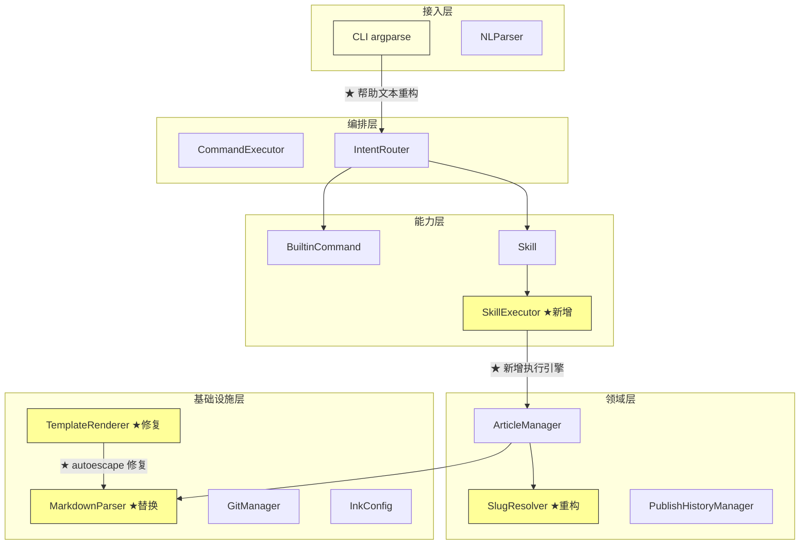
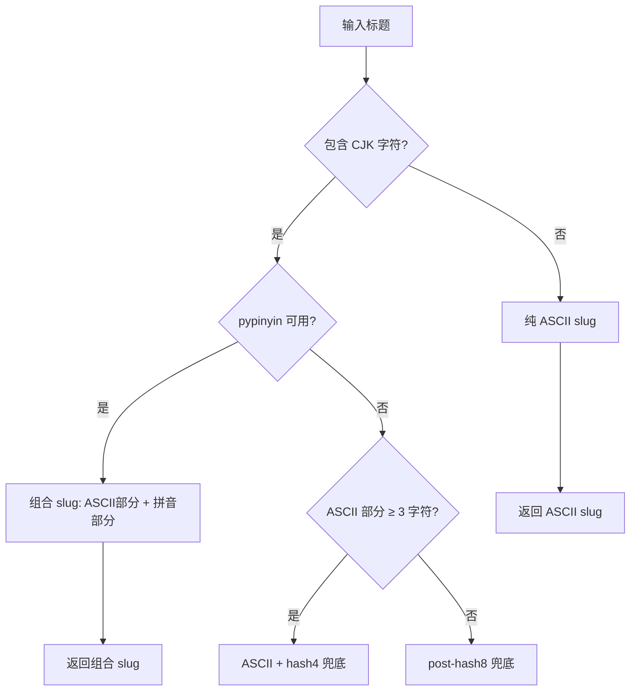
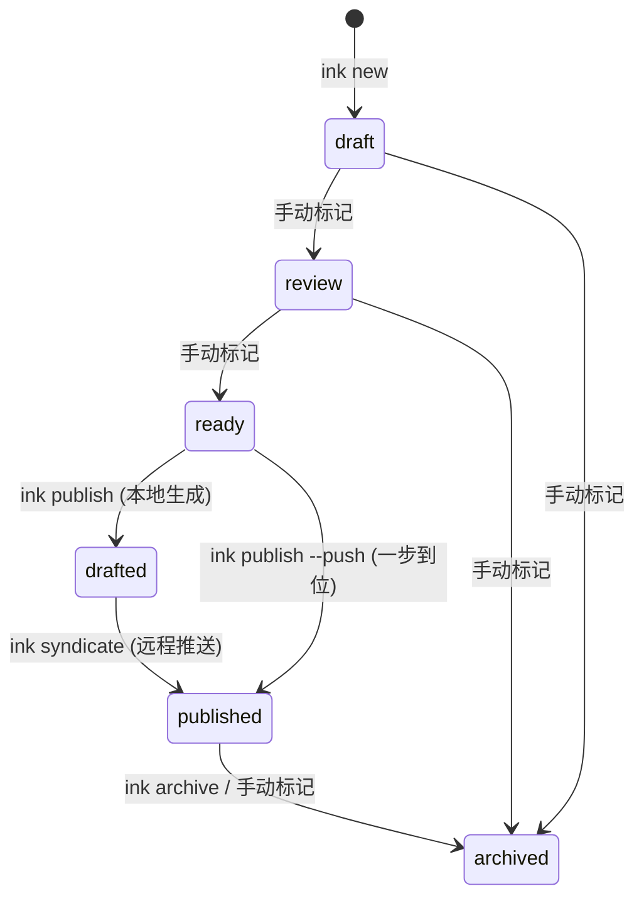
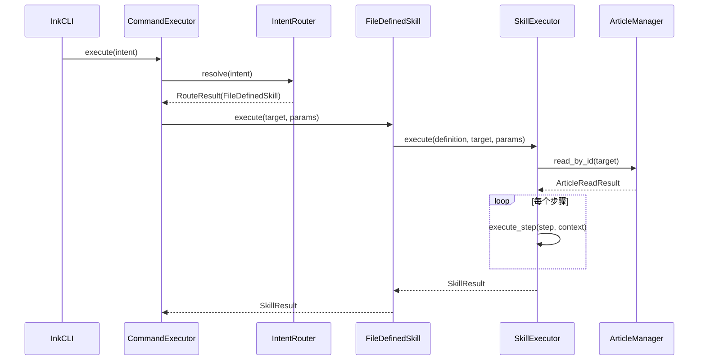

# 设计文档：补工程硬伤（ink-engineering-hardening）

## 概述

本设计文档覆盖 Ink Blog Core v0.4.0 / v0.4.1 的核心工程改进——"补工程硬伤"阶段。当前 v0.3.0 在实际使用中暴露出六个工程级缺陷，它们不是功能缺失，而是现有功能的实现质量问题，直接影响中文用户体验、内容安全性和系统可扩展性。

### 实施边界声明

- **v0.4.0 只解决工程硬伤**，不引入新的内容对象类型，不引入多节点机制，不实现 Hub，不实现 Conversation 管理。
- **状态机扩展与真实远程发布解耦**：v0.4.0 引入 `ArticleStatus` 枚举修正语义，但不要求提供完整 `syndicate` 命令与远程推送实现。`drafted` 状态、`ink syndicate` 命令、`ink publish --push`、批量迁移工具均推迟到 v0.4.1。
- **SkillExecutor 不是 Agent Runtime**：v0.4.0 的 SkillExecutor 仅用于解释执行极小型内容处理步骤（严格 DSL），不承诺通用脚本能力，不支持任意命令执行。

### 版本拆分

| 版本 | 范围 | 硬伤 |
|------|------|------|
| **v0.4.0** | 底层硬伤，影响每次创建/渲染/执行 | ① 中文 slug ② Markdown 渲染 + XSS ③ Jinja2 autoescape ④ Skill 执行引擎 |
| **v0.4.1** | 语义与产品层清晰化 | ⑤ 发布状态机完整扩展（drafted/syndicate） ⑥ CLI 命令/Skill 边界 |

六个硬伤按优先级排列：

1. **中文 slug 不友好** — 当前 `SlugResolver` 将所有非 ASCII 字符替换为连字符，中文标题几乎必然退化为 `untitled`，导致 Canonical ID 失去语义
2. **发布状态机过于粗糙** — `draft → review → ready → published → archived` 五态模型无法区分"已生成本地草稿"和"已真实发布到远程平台"，且 `draft_saved` 渠道结果会错误地将文章整体状态推进到 `published`
3. **手写 Markdown/HTML 渲染过重** — `renderer.py` 中 `_md_to_html()` 是 ~200 行手写正则解析器，不支持嵌套列表、脚注、删除线等常见 Markdown 扩展，且段落内 HTML 未转义存在 XSS 风险
4. **自定义 Skill 还不可执行** — `FileDefinedSkill.execute()` 返回"暂未实现"，`.ink/skills/*.md` 定义的技能无法真正运行
5. **命令与 Skill 边界略混** — README 将 publish/analyze/search 呈现为一等命令，但实际是 Skill；用户无法从 CLI 帮助中区分两者
6. **Jinja2 渲染默认关闭安全转义** — `TemplateRenderer` 全局 `autoescape=False`，用户自定义模板中的 `{{ title }}` 等变量未转义，存在 XSS 注入风险

本设计遵循 Ink 的三条核心原则：**FS-as-DB**（文件系统即数据库）、**最小依赖**（运行时仅 pyyaml + jinja2 + 新增可选依赖）、**双模对称**（human/agent 共享基础设施）。

---

## 架构

### 变更影响范围



标注说明：★ 表示本次变更涉及的组件。黄色填充为新增/重构组件，浅黄色为需要调整的组件。

### 变更矩阵

| 硬伤 | 影响层 | 变更类型 | 风险等级 |
|------|--------|----------|----------|
| 中文 slug | 领域层 | 重构 `SlugResolver` | 中（影响 Canonical ID 生成） |
| 发布状态机 | 领域层 + 能力层 | 扩展状态枚举 + 迁移逻辑 | 中（需向后兼容） |
| Markdown 渲染 | 基础设施层 | 替换 `_md_to_html()` | 低（纯输出变更） |
| Skill 执行引擎 | 能力层 | 新增 `SkillExecutor` | 低（新增功能） |
| 命令/Skill 边界 | 接入层 | CLI 帮助文本重构 | 低（不影响功能） |
| Jinja2 autoescape | 基础设施层 | 修改 `TemplateRenderer` | 低（安全加固） |

---

## 组件与接口

### 硬伤 1：中文 slug 不友好

#### 问题分析

当前 `SlugResolver.generate_slug()` 的核心逻辑：

```python
# 当前实现（ink_core/fs/article.py）
slug = re.sub(r'[^a-z0-9]+', '-', slug)  # 所有非 ASCII 字母数字 → 连字符
```

对于中文标题 `"深度学习入门指南"`，处理流程为：
1. `lower()` → `"深度学习入门指南"`（中文无大小写变化）
2. `re.sub(r'[^a-z0-9]+', '-', ...)` → `"-"`（所有中文字符被替换）
3. `strip('-')` → `""`
4. 空字符串 → `"untitled"`

结果：所有纯中文标题的 slug 都是 `untitled`，第二篇中文文章就会触发 `PathConflictError`。

#### 设计方案：分类 Fallback 策略

```
标题 → 判断类型 → 纯英文走 ASCII / 含 CJK 走组合拼音 / 兜底走哈希
```



核心规则变更：**不再使用"ASCII ≥ 3 就直接返回"**。中英混合标题优先组合 ASCII + 拼音，避免 `Python 深度学习` / `Python 机器学习` / `Python 提示词工程` 全部退化为 `python`。

#### 新增依赖

```toml
# pyproject.toml
[project.optional-dependencies]
pinyin = ["pypinyin>=0.50"]
```

`pypinyin` 作为可选依赖。未安装时自动降级到哈希方案，核心路径不受影响。

#### 接口变更

```python
# ink_core/fs/article.py — SlugResolver 重构

class SlugResolver:
    MAX_SLUG_LENGTH = 60

    def __init__(self, workspace_root: Path) -> None:
        self.workspace_root = workspace_root
        self._pinyin_available = self._check_pinyin()

    def generate_slug(self, title: str) -> str:
        """分类 Fallback 生成 slug。

        策略：
        1. 纯英文标题：直接 ASCII slug
        2. 含 CJK 字符：
           a. pypinyin 可用 → 组合 slug（ASCII 部分 + 拼音部分）
           b. pypinyin 不可用且 ASCII ≥ 3 → ASCII + hash4 兜底
           c. 否则 → post-hash8 兜底
        3. 无 CJK 无足够 ASCII → post-hash8 兜底
        """
        has_cjk = self._has_cjk(title)

        if not has_cjk:
            # 纯英文/非 CJK 标题：直接 ASCII
            ascii_slug = self._extract_ascii(title)
            if ascii_slug:
                return self._truncate(ascii_slug)
            return self._hash_slug(title)

        # 含 CJK 字符的标题
        if self._pinyin_available:
            # 组合策略：pypinyin 会自动处理中英混合
            # 'Python 深度学习' → 'python-shen-du-xue-xi'
            pinyin_slug = self._to_pinyin(title)
            if pinyin_slug:
                return self._truncate(pinyin_slug)

        # pypinyin 不可用：ASCII + hash4 兜底
        ascii_part = self._extract_ascii(title)
        if len(ascii_part) >= 3:
            hash4 = self._short_hash(title, 4)
            return self._truncate(f"{ascii_part}-{hash4}")

        # 最终兜底
        return self._hash_slug(title)

    def _extract_ascii(self, title: str) -> str:
        """提取标题中的 ASCII 字母数字部分，生成 slug。"""
        slug = title.lower()
        slug = re.sub(r'[^a-z0-9]+', '-', slug)
        slug = re.sub(r'-+', '-', slug)
        return slug.strip('-')

    def _has_cjk(self, text: str) -> bool:
        """检测文本是否包含 CJK 统一表意文字。"""
        return bool(re.search(r'[\u4e00-\u9fff\u3400-\u4dbf]', text))

    def _to_pinyin(self, title: str) -> str:
        """将中文标题转换为拼音 slug。

        示例：'深度学习入门指南' → 'shen-du-xue-xi-ru-men-zhi-nan'
        混合文本：'Python 深度学习' → 'python-shen-du-xue-xi'
        """
        try:
            from pypinyin import lazy_pinyin, Style
            parts = lazy_pinyin(title, style=Style.NORMAL)
            slug = '-'.join(parts)
            # 清理：只保留 ASCII 字母数字和连字符
            slug = re.sub(r'[^a-z0-9-]+', '-', slug.lower())
            slug = re.sub(r'-+', '-', slug)
            return slug.strip('-')
        except Exception:
            return ''

    def _hash_slug(self, title: str) -> str:
        """使用 SHA256 前 8 位作为兜底 slug。

        格式：'post-<hash8>'，确保有语义前缀。
        """
        import hashlib
        h = hashlib.sha256(title.encode('utf-8')).hexdigest()[:8]
        return f'post-{h}'

    def _short_hash(self, title: str, length: int = 4) -> str:
        """生成短哈希，用于 ASCII + hash 组合兜底。"""
        import hashlib
        return hashlib.sha256(title.encode('utf-8')).hexdigest()[:length]

    def _truncate(self, slug: str) -> str:
        """截断到 MAX_SLUG_LENGTH，尽量在连字符处断开。"""
        if len(slug) <= self.MAX_SLUG_LENGTH:
            return slug
        truncated = slug[:self.MAX_SLUG_LENGTH]
        last_hyphen = truncated.rfind('-')
        if last_hyphen > 0:
            truncated = truncated[:last_hyphen]
        return truncated.strip('-')

    @staticmethod
    def _check_pinyin() -> bool:
        """检测 pypinyin 是否可用。"""
        try:
            import pypinyin  # noqa: F401
            return True
        except ImportError:
            return False

    def check_conflict(self, date: str, slug: str) -> bool:
        """检测目标路径是否已存在（不变）。"""
        year, month, day = date.split('-')
        folder_name = f"{day}-{slug}"
        target_path = self.workspace_root / year / month / folder_name
        return target_path.exists()
```

#### Slug 生成示例

| 标题 | 类型 | 策略 | 最终结果 |
|------|------|------|----------|
| `"Liquid Blog"` | 纯英文 | ASCII | `liquid-blog` |
| `"深度学习入门指南"` | 纯中文 | 拼音 | `shen-du-xue-xi-ru-men-zhi-nan` |
| `"Python 深度学习"` | 中英混合 | 组合拼音 | `python-shen-du-xue-xi` |
| `"Python 机器学习"` | 中英混合 | 组合拼音 | `python-ji-qi-xue-xi` |
| `"AI 入门"` | 中英混合 | 组合拼音 | `ai-ru-men` |
| `"Python 深度学习"` (无 pypinyin) | 中英混合 | ASCII+hash4 | `python-a1b2` |
| `"深度学习"` (无 pypinyin) | 纯中文 | hash8 | `post-e5f6g7h8` |
| `"🎉🎊🎈"` | 无 CJK 无 ASCII | hash8 | `post-a1b2c3d4` |


---

### 硬伤 2：发布状态机过于粗糙

#### 问题分析

当前五态模型：

```
draft → review → ready → published → archived
```

`published` 同时表示两种语义：
- "已通过 `ink publish` 生成本地格式化文件"（Phase 1 的 `BlogFileAdapter` 等）
- "已真实发布到远程平台"（Phase 2 计划接入的真实 API）

当 Phase 2 引入真实发布适配器时，一篇文章可能处于"本地草稿已生成但尚未推送到远程"的中间状态，当前模型无法表达。

#### 设计方案：六态模型



| 状态 | 含义 | 触发方式 |
|------|------|----------|
| `draft` | 草稿，新建默认 | `ink new` |
| `review` | 审阅中 | 手动修改 frontmatter |
| `ready` | 准备发布 | 手动修改 frontmatter |
| `drafted` | 本地格式化文件已生成 | `ink publish`（Phase 1 行为不变） |
| `published` | 已真实发布到远程平台 | `ink syndicate` 或 `ink publish --push` |
| `archived` | 已归档 | `ink archive` 或手动修改 |

#### 向后兼容策略

**v0.4.0 只做两件事：**

1. **引入 `ArticleStatus` 枚举**：统一所有硬编码的状态字符串，提供 `is_valid()`、`is_publishable()` 等方法
2. **修复 PublishSkill 语义 bug**：当前只要任一渠道返回 `success` 或 `draft_saved`，就会把文章整体状态写成 `published`。修复后，仅当至少一个渠道真正 `success` 时才更新状态

**v0.4.1 再做完整扩展：**

1. 新增 `drafted` 状态：`ink publish` 改为设置 `drafted`
2. 新增 `ink syndicate` 命令：设置 `published`
3. 新增 `ink publish --push`：一步到位
4. 提供 `ink doctor --migrate-status` 迁移脚本

#### SiteBuilder 构建策略

**`drafted` 状态的文章默认不公开构建到站点。** `drafted` 的语义是"本地格式化产物已生成，但尚未真实发布"，更适合本地预览而非公开展示。

- `ink build` 默认仍只构建 `status=published` 的文章
- v0.4.1 可加 `ink build --include-drafted` 作为预览模式

#### 接口变更

```python
# ink_core/core/status.py — 新增文件

from enum import Enum

class ArticleStatus(str, Enum):
    """文章生命周期状态枚举。"""
    DRAFT = "draft"
    REVIEW = "review"
    READY = "ready"
    DRAFTED = "drafted"      # ★ 新增：本地格式化文件已生成
    PUBLISHED = "published"  # 已真实发布到远程平台
    ARCHIVED = "archived"

    @classmethod
    def is_publishable(cls, status: str) -> bool:
        """判断是否可执行 ink publish。"""
        return status == cls.READY.value

    @classmethod
    def is_syndicatable(cls, status: str) -> bool:
        """判断是否可执行 ink syndicate（Phase 2）。"""
        return status == cls.DRAFTED.value

    @classmethod
    def is_visible_in_search(cls, status: str) -> bool:
        """判断是否在默认搜索结果中可见。"""
        return status not in (cls.ARCHIVED.value,)

    @classmethod
    def is_valid(cls, status: str) -> bool:
        """判断是否为合法状态值。"""
        return status in {s.value for s in cls}

    @classmethod
    def valid_transitions(cls) -> dict[str, list[str]]:
        """返回合法状态迁移表。"""
        return {
            cls.DRAFT.value: [cls.REVIEW.value, cls.ARCHIVED.value],
            cls.REVIEW.value: [cls.READY.value, cls.DRAFT.value, cls.ARCHIVED.value],
            cls.READY.value: [cls.DRAFTED.value, cls.PUBLISHED.value, cls.ARCHIVED.value],
            cls.DRAFTED.value: [cls.PUBLISHED.value, cls.READY.value, cls.ARCHIVED.value],
            cls.PUBLISHED.value: [cls.ARCHIVED.value],
            cls.ARCHIVED.value: [cls.DRAFT.value],
        }
```

#### PublishSkill 变更

```python
# ink_core/skills/publish.py — execute() 中的状态更新逻辑

# Phase 1 保持不变：status → published
# Phase 2 切换后：
#   ink publish → status = drafted
#   ink syndicate → status = published

# 发布门控同时接受 ready（向后兼容）
if current_status not in (ArticleStatus.READY.value,):
    return SkillResult(
        success=False,
        message=f"Article status is '{current_status}', expected 'ready'.",
    )
```

#### 搜索与列表的兼容处理

```python
# 所有读取 status 的地方使用 ArticleStatus 枚举方法
# SearchSkill: 排除 archived（不变）
# SiteBuilder: v0.4.0 默认仍只构建 published（不变）
#              v0.4.1 可加 --include-drafted 预览模式
# timeline.json: status 字段值域扩展，新增 drafted（v0.4.1）
```

---

### 硬伤 3：手写 Markdown/HTML 渲染过重

#### 问题分析

当前 `ink_core/site/renderer.py` 中的 `_md_to_html()` 函数是一个 ~200 行的手写正则 Markdown 解析器。存在以下问题：

1. **功能缺失**：不支持嵌套列表、脚注、删除线、任务列表、自动链接等常见 Markdown 扩展
2. **安全风险**：`_inline()` 函数不对段落内的 HTML 标签做转义，用户在 Markdown 中写入 `<script>` 标签会直接渲染
3. **维护成本高**：每增加一个 Markdown 特性都需要手写正则，容易引入 bug
4. **边界情况多**：多行 blockquote、嵌套代码块、混合 HTML 等场景处理不完善

#### 设计方案：引入 mistune 作为可选依赖

选择 `mistune` 而非 `markdown-it-py` 的理由：

| 维度 | mistune | markdown-it-py |
|------|---------|----------------|
| 依赖数 | 0（纯 Python） | 1（mdurl） |
| 包大小 | ~100KB | ~200KB |
| 性能 | 快（C 风格解析器） | 中等 |
| 扩展性 | 插件系统 | 插件系统 |
| 安全性 | 内置 HTML 转义 | 内置 HTML 转义 |
| 维护状态 | 活跃 | 活跃 |

`mistune` 更符合 Ink 的"最小依赖"哲学。

#### 新增依赖

```toml
# pyproject.toml
[project.optional-dependencies]
markdown = ["mistune>=3.0"]
```

`mistune` 作为可选依赖。未安装时回退到改进后的内置解析器（修复安全问题）。

#### 接口变更

```python
# ink_core/fs/markdown_renderer.py — 新增文件
# 重要：此模块完全独立，不 import site.renderer，避免循环依赖

"""Markdown → HTML 渲染器，支持 mistune（可选）和内置 fallback。

职责边界：
- 此模块负责所有 Markdown → HTML 转换
- site/renderer.py 只负责模板渲染和页面组装，不再包含 Markdown 解析逻辑
- 内置 fallback 渲染器的 _inline_safe() 等函数直接定义在此模块中，
  不回头 import site.renderer 中的 _md_to_html / _inline
"""

from __future__ import annotations


def render_markdown(md: str, *, safe: bool = True) -> str:
    """将 Markdown 转换为 HTML。

    Args:
        md: Markdown 源文本
        safe: 是否启用 HTML 转义（默认 True）

    Returns:
        HTML 字符串

    策略：
    1. 若 mistune 可用，使用 mistune 渲染（推荐）
    2. 否则使用内置 fallback 渲染器（已修复安全问题，完全自包含）
    """
    if _mistune_available():
        return _render_with_mistune(md, safe=safe)
    return _render_builtin(md, safe=safe)


def _mistune_available() -> bool:
    try:
        import mistune  # noqa: F401
        return True
    except ImportError:
        return False


def _render_with_mistune(md: str, *, safe: bool = True) -> str:
    """使用 mistune 渲染 Markdown。"""
    import mistune

    if safe:
        renderer = mistune.create_markdown(escape=True)
    else:
        renderer = mistune.create_markdown(escape=False)

    return renderer(md)


def _render_builtin(md: str, *, safe: bool = True) -> str:
    """内置 fallback 渲染器（完全自包含，不依赖 site.renderer）。

    从现有 _md_to_html 逻辑迁移而来，修复点：
    1. _inline_safe() 中对非代码块内的 HTML 标签做转义
    2. 所有 Markdown 解析逻辑自包含在此模块
    """
    # 实现时将 site/renderer.py 中的 _md_to_html() 和 _inline()
    # 完整迁移到此处，重命名为 _md_to_html_builtin() 和 _inline_safe()
    # site/renderer.py 中的原始函数可保留但标记为 deprecated
    ...
```

#### renderer.py 变更

```python
# ink_core/site/renderer.py — render_article() 中替换 _md_to_html 调用

def render_article(self, article, output_path, site_title="Blog"):
    from ink_core.fs.markdown import parse_frontmatter
    from ink_core.fs.markdown_renderer import render_markdown  # ★ 新导入

    meta, body = parse_frontmatter(article.l2)
    # ...
    body_html = render_markdown(body)  # ★ 默认 safe=True：原始 HTML 被转义
    # ...
```

#### 内置渲染器安全修复

```python
# ink_core/site/renderer.py — _inline() 函数修复

def _inline(text: str, *, escape_html: bool = True) -> str:
    """行内 Markdown 转换，增加 HTML 转义选项。"""
    import re

    if escape_html:
        # 先转义 HTML 标签，再处理 Markdown 语法
        text = text.replace("&", "&amp;")
        text = text.replace("<", "&lt;")
        text = text.replace(">", "&gt;")

    # 然后处理 Markdown 行内语法（代码、加粗、斜体、链接、图片）
    text = re.sub(r"`([^`]+)`", lambda m: f"<code>{_escape(m.group(1))}</code>", text)
    text = re.sub(r"\*\*(.+?)\*\*", r"<strong>\1</strong>", text)
    text = re.sub(r"__(.+?)__", r"<strong>\1</strong>", text)
    text = re.sub(r"\*(.+?)\*", r"<em>\1</em>", text)
    text = re.sub(r"_(.+?)_", r"<em>\1</em>", text)
    text = re.sub(r"!\[([^\]]*)\]\(([^\)]+)\)", r'', text)
    text = re.sub(r"\[([^\]]+)\]\(([^\)]+)\)", r'<a href="\2">\1</a>', text)
    text = re.sub(r"\[\[([^\]]+)\]\]", r"\1", text)
    return text
```

---

### 硬伤 4：自定义 Skill 还不可执行

#### 问题分析

当前 `FileDefinedSkill`（通过 `SkillFileLoader` 从 `.ink/skills/*.md` 加载）的 `execute()` 方法是空壳：

```python
# 当前 ink_core/skills/registry.py 中的 FileDefinedSkill
class FileDefinedSkill(Skill):
    def execute(self, target, params):
        return SkillResult(
            success=False,
            message="暂未实现可执行逻辑",
        )
```

用户在 `.ink/skills/` 下定义的技能无法真正执行，Skill 系统形同虚设。

#### 设计方案：最小 Skill 执行引擎

实现一个基于步骤定义的解释执行引擎，支持两种基础步骤类型：`read_content` 和 `write_file`。

**重要约束：SkillExecutor 不是 Agent Runtime。** 步骤语言是严格的极小命令式 DSL，不做"自然语言步骤解释器"。

支持的 DSL 语法（v0.4.0）：
```
read_content <L0|L1|L2>
write_file <relative_path>
```

后续可扩展（不在 v0.4.0 范围内）：
```
extract_frontmatter
render_template <template_name>
append_note <content>
```

**参数链传递**：`FileDefinedSkill` 构造函数改为 `__init__(definition, workspace_root)`，`SkillRegistry` 必须持有或在 `load_from_directory()` 时传入 `workspace_root`。



#### 新增组件

```python
# ink_core/skills/executor.py — 新增文件

"""最小 Skill 执行引擎。"""

from __future__ import annotations

import logging
from dataclasses import dataclass, field
from pathlib import Path
from typing import Any

from ink_core.fs.article import ArticleManager
from ink_core.skills.base import SkillResult
from ink_core.skills.loader import SkillDefinition

logger = logging.getLogger(__name__)


@dataclass
class StepContext:
    """步骤执行上下文，在步骤间传递数据。"""
    target: str | None
    params: dict
    workspace_root: Path
    content: str = ""           # 当前读取的内容
    metadata: dict = field(default_factory=dict)  # frontmatter
    variables: dict = field(default_factory=dict)  # 步骤间传递的变量
    changed_files: list[Path] = field(default_factory=list)
    outputs: list[str] = field(default_factory=list)  # 步骤输出日志


class SkillExecutor:
    """解释执行 SkillDefinition 中的步骤。

    支持的步骤类型：
    - read_content: 读取目标文章的指定层级内容
    - write_file: 将内容写入指定路径
    """

    SUPPORTED_STEP_TYPES = {"read_content", "write_file"}

    def __init__(self, workspace_root: Path) -> None:
        self._workspace_root = workspace_root
        self._article_manager = ArticleManager(workspace_root)

    def execute(
        self,
        definition: SkillDefinition,
        target: str | None,
        params: dict,
    ) -> SkillResult:
        """执行 Skill 定义中的所有步骤。

        Args:
            definition: 从 .md 文件解析的 Skill 定义
            target: 目标 Canonical ID
            params: 用户传入的参数

        Returns:
            SkillResult，包含执行结果和变更文件列表
        """
        ctx = StepContext(
            target=target,
            params=params,
            workspace_root=self._workspace_root,
        )

        # 根据 context_requirement 预加载内容
        if target:
            try:
                self._preload_content(ctx, definition.context_requirement)
            except Exception as e:
                return SkillResult(
                    success=False,
                    message=f"Failed to load content: {e}",
                )

        # 逐步执行
        for i, step_text in enumerate(definition.steps):
            step_type, step_params = self._parse_step(step_text)

            if step_type not in self.SUPPORTED_STEP_TYPES:
                logger.warning(
                    "SkillExecutor: unsupported step type '%s' in step %d, skipping",
                    step_type, i + 1,
                )
                ctx.outputs.append(f"Step {i+1}: skipped (unsupported type '{step_type}')")
                continue

            try:
                self._execute_step(step_type, step_params, ctx)
                ctx.outputs.append(f"Step {i+1}: {step_type} completed")
            except Exception as e:
                return SkillResult(
                    success=False,
                    message=f"Step {i+1} ({step_type}) failed: {e}",
                    changed_files=ctx.changed_files,
                )

        return SkillResult(
            success=True,
            message=f"Skill '{definition.skill}' executed successfully ({len(definition.steps)} steps)",
            data={"outputs": ctx.outputs, "variables": ctx.variables},
            changed_files=ctx.changed_files,
        )

    def _preload_content(self, ctx: StepContext, requirement: str) -> None:
        """根据 context_requirement 预加载文章内容到上下文。"""
        if not ctx.target:
            return

        result = self._article_manager.read_by_id(ctx.target)
        article = result.article

        if requirement == "L0":
            ctx.content = article.l0
        elif requirement == "L1":
            ctx.content = article.l0  # L1 包含 L0
            ctx.metadata = article.l1
        else:  # L2
            ctx.content = article.l2
            ctx.metadata = article.l1

        ctx.variables["canonical_id"] = article.canonical_id
        ctx.variables["title"] = article.slug
        ctx.variables["date"] = article.date

    def _parse_step(self, step_text: str) -> tuple[str, dict]:
        """从步骤文本中解析步骤类型和参数。

        支持格式：
        - "read_content L2"
        - "write_file output.md"
        - "读取 frontmatter" → 映射到 read_content
        """
        parts = step_text.strip().split(None, 1)
        step_type = parts[0].lower() if parts else ""
        step_params_str = parts[1] if len(parts) > 1 else ""

        # 中文关键词映射
        cn_mapping = {
            "读取": "read_content",
            "写入": "write_file",
        }
        step_type = cn_mapping.get(step_type, step_type)

        return step_type, {"args": step_params_str}

    def _execute_step(
        self, step_type: str, step_params: dict, ctx: StepContext
    ) -> None:
        """执行单个步骤。"""
        if step_type == "read_content":
            self._step_read_content(step_params, ctx)
        elif step_type == "write_file":
            self._step_write_file(step_params, ctx)

    def _step_read_content(self, step_params: dict, ctx: StepContext) -> None:
        """读取目标文章内容到上下文。"""
        if not ctx.target:
            raise ValueError("No target specified for read_content step")

        args = step_params.get("args", "L2")
        result = self._article_manager.read_by_id(ctx.target)
        article = result.article

        layer = args.strip().upper()
        if layer == "L0":
            ctx.content = article.l0
        elif layer == "L1":
            ctx.content = str(article.l1)
        else:
            ctx.content = article.l2

    def _step_write_file(self, step_params: dict, ctx: StepContext) -> None:
        """将当前上下文内容写入指定文件。"""
        args = step_params.get("args", "")
        if not args:
            raise ValueError("write_file step requires a file path argument")

        # 路径穿越防护
        rel_path = args.strip()
        if rel_path.startswith('/'):
            raise ValueError(f"write_file rejects absolute path: {rel_path}")

        output_base = ctx.workspace_root / ".ink" / "skill-output"
        output_path = (output_base / rel_path).resolve()

        # 规范化后必须仍在 .ink/skill-output/ 下
        if not str(output_path).startswith(str(output_base.resolve())):
            raise ValueError(
                f"write_file path traversal detected: '{rel_path}' resolves outside .ink/skill-output/"
            )

        output_path.parent.mkdir(parents=True, exist_ok=True)
        output_path.write_text(ctx.content, encoding="utf-8")
        ctx.changed_files.append(output_path)
```

#### FileDefinedSkill 更新

```python
# ink_core/skills/registry.py — FileDefinedSkill.execute() 更新

class FileDefinedSkill(Skill):
    """从 .ink/skills/*.md 加载的用户自定义 Skill。"""

    def __init__(self, definition: SkillDefinition, workspace_root: Path) -> None:
        self._definition = definition
        self._workspace_root = workspace_root

    @property
    def name(self) -> str:
        return self._definition.skill

    @property
    def version(self) -> str:
        return self._definition.version

    @property
    def context_requirement(self) -> str:
        return self._definition.context_requirement

    def execute(self, target: str | None, params: dict) -> SkillResult:
        """通过 SkillExecutor 执行 Skill 定义中的步骤。"""
        from ink_core.skills.executor import SkillExecutor

        executor = SkillExecutor(self._workspace_root)
        return executor.execute(self._definition, target, params)
```

#### Skill 定义文件示例

```markdown
---
skill: summarize
version: "1.0"
description: 生成文章摘要到输出文件
context_requirement: L2
---

## 输入

- source: 文章路径

## 执行流程

1. read_content L2
2. write_file summarize-output.md
```


---

### 硬伤 5：命令与 Skill 边界略混

#### 问题分析

当前 CLI 帮助输出中，`publish`、`analyze`、`search` 与 `new`、`init`、`rebuild` 并列显示为子命令，但前三者实际是通过 `SkillRegistry` 注册的 Skill，后三者是 `BuiltinCommand`。用户无法从帮助文本中区分两者，也不理解为什么 `ink skills list` 只列出 Skill 而不包含 `new`/`init`。

#### 设计方案：CLI 帮助分组 + 统一入口

不改变底层路由机制（`IntentRouter` 先查 BuiltinCommand 再查 Skill 的逻辑不变），仅在用户可见层面做清晰化：

1. **argparse 帮助分组**：将子命令分为"核心命令"和"技能命令"两组
2. **`ink help` 增强**：显示分组帮助，标注哪些是内置命令、哪些是 Skill
3. **`ink skills list` 增强**：同时显示内置 Skill 和用户自定义 Skill，标注来源

#### 接口变更

```python
# ink_core/cli/parser.py — _build_arg_parser() 修改

def _build_arg_parser() -> argparse.ArgumentParser:
    parser = argparse.ArgumentParser(
        prog="ink",
        description="Ink Blog Core — CLI + Skills + Markdown",
    )

    sub = parser.add_subparsers(dest="command")

    # ═══ 核心命令（BuiltinCommand）═══
    # 这些命令直接操作文件系统，不经过 SkillRegistry

    p_init = sub.add_parser("init", help="[核心] 初始化工作区与 Git 仓库")
    p_new = sub.add_parser("new", help="[核心] 创建新文章")
    p_rebuild = sub.add_parser("rebuild", help="[核心] 重建所有派生文件与索引")
    p_build = sub.add_parser("build", help="[核心] 生成静态 HTML 站点")
    p_skills = sub.add_parser("skills", help="[核心] 管理已注册技能")

    # ═══ 技能命令（Skill）═══
    # 这些命令通过 SkillRegistry 路由，可被用户自定义 Skill 覆盖

    p_pub = sub.add_parser("publish", help="[技能] 发布文章到指定渠道")
    p_ana = sub.add_parser("analyze", help="[技能] 分析文章内容与知识图谱")
    p_srch = sub.add_parser("search", help="[技能] 搜索文章库")

    # ═══ Agent 模式命令 ═══
    p_log = sub.add_parser("log", help="[Agent] 追加日记条目")
    p_recall = sub.add_parser("recall", help="[Agent] 检索过往日记")
    p_serve = sub.add_parser("serve", help="[Agent] 启动 HTTP API 服务器")
    # ... 其余 agent 命令

    # 参数定义不变...
    return parser
```

#### `ink skills list` 输出增强

```
$ ink skills list

内置技能 (Built-in):
  publish    v1.0  发布文章到多渠道          [L2]
  analyze    v1.0  文章分析与知识图谱        [L1]
  search     v1.0  分层搜索                  [L0]

自定义技能 (Custom):
  summarize  v1.0  生成文章摘要              [L2]  .ink/skills/summarize.md
```

---

### 硬伤 6：Jinja2 渲染默认关闭安全转义

#### 问题分析

当前 `TemplateRenderer` 在所有渲染路径中使用 `autoescape=False`：

```python
# 当前实现
def _render(self, template_name, default_src, ctx, autoescape=False):
    # ...
    env = jinja2.Environment(loader=..., autoescape=autoescape)
```

这意味着模板中的 `{{ title }}`、`{{ tags }}` 等变量如果包含 HTML 特殊字符（如 `<script>`），会被直接渲染为 HTML，存在 XSS 风险。

`body_html` 是已经渲染好的 HTML，需要标记为安全字符串以避免被二次转义。

#### 设计方案：选择性 autoescape

```python
# ink_core/site/renderer.py — TemplateRenderer 修改

class TemplateRenderer:
    def render_article(self, article, output_path, site_title="Blog"):
        from ink_core.fs.markdown import parse_frontmatter
        from ink_core.fs.markdown_renderer import render_markdown
        from markupsafe import Markup  # ★ 从 markupsafe 导入，兼容性更稳

        meta, body = parse_frontmatter(article.l2)
        title = meta.get("title", article.slug)
        date = article.date
        tags = meta.get("tags") or []
        abstract = article.l0 or ""
        body_html = render_markdown(body)  # ★ 默认 safe=True
        toc = _extract_toc(body)

        ctx = {
            "title": title,
            "site_title": site_title,
            "date": date,
            "tags": tags,
            "abstract": abstract,
            "body_html": Markup(body_html),  # ★ 标记为安全 HTML
            "toc": toc,
            "canonical_id": article.canonical_id,
        }

        output_path.parent.mkdir(parents=True, exist_ok=True)
        # ★ autoescape=True：所有变量默认转义，body_html 因 Markup 标记不会被转义
        html = self._render(
            self.ARTICLE_TEMPLATE_NAME,
            _DEFAULT_ARTICLE_TEMPLATE,
            ctx,
            autoescape=True,  # ★ 改为 True
        )
        output_path.write_text(html, encoding="utf-8")

    def render_index(self, articles, output_path, site_title="Blog",
                     site_config=None):
        # ... 同样改为 autoescape=True
        html = self._render(
            self.INDEX_TEMPLATE_NAME,
            _DEFAULT_INDEX_TEMPLATE,
            ctx,
            autoescape=True,  # ★ 改为 True
        )
        output_path.write_text(html, encoding="utf-8")

    def _render(self, template_name, default_src, ctx, autoescape=True):
        """渲染模板，默认启用 autoescape。"""
        user_template_path = self._workspace_root / self.TEMPLATE_DIR / template_name
        if user_template_path.exists():
            env = self._get_fs_env(autoescape=autoescape)
            tmpl = env.get_template(template_name)
        else:
            env = jinja2.Environment(
                loader=jinja2.BaseLoader(),
                autoescape=autoescape,  # ★ 默认 True
            )
            tmpl = env.from_string(default_src)
        return tmpl.render(**ctx)

    def _get_fs_env(self, autoescape=True) -> jinja2.Environment:
        """获取文件系统模板环境，autoescape 默认开启。

        不缓存 env 实例：autoescape 开/关一旦混进缓存环境会特别难排查。
        模板渲染不是热路径，每次创建新 env 的开销可忽略。
        """
        template_dir = str(self._workspace_root / self.TEMPLATE_DIR)
        return jinja2.Environment(
            loader=jinja2.FileSystemLoader(template_dir),
            autoescape=autoescape,
        )
```

#### 影响分析

| 模板变量 | 类型 | autoescape 行为 |
|----------|------|-----------------|
| `{{ title }}` | `str` | ★ 自动转义（安全） |
| `{{ date }}` | `str` | ★ 自动转义（安全） |
| `{{ tags }}` | `list[str]` | ★ 自动转义（安全） |
| `{{ body_html }}` | `Markup` | 不转义（已标记安全） |
| `{{ abstract }}` | `str` | ★ 自动转义（安全） |
| `{{ site_title }}` | `str` | ★ 自动转义（安全） |

用户自定义模板中如果需要输出原始 HTML，可使用 Jinja2 的 `|safe` 过滤器。

---

## 数据模型变更

### 状态枚举扩展

```python
# 新增 ink_core/core/status.py
# 详见硬伤 2 设计方案
```

### Slug 生成策略变更

不影响现有数据模型。`Article.slug` 字段类型不变（`str`），仅生成逻辑变更。已有文章的 slug 不受影响。

### 新增文件

| 文件 | 用途 |
|------|------|
| `ink_core/core/status.py` | `ArticleStatus` 枚举与状态迁移规则 |
| `ink_core/fs/markdown_renderer.py` | Markdown → HTML 渲染器（mistune + fallback） |
| `ink_core/skills/executor.py` | `SkillExecutor` 最小执行引擎 |

### 修改文件

| 文件 | 变更内容 |
|------|----------|
| `ink_core/fs/article.py` | `SlugResolver` 三级 Fallback 重构 |
| `ink_core/site/renderer.py` | autoescape 修复 + 使用新 Markdown 渲染器 |
| `ink_core/skills/registry.py` | `FileDefinedSkill.execute()` 接入 `SkillExecutor` |
| `ink_core/skills/publish.py` | 使用 `ArticleStatus` 枚举 |
| `ink_core/cli/parser.py` | CLI 帮助文本分组 |
| `pyproject.toml` | 新增可选依赖 `pypinyin`、`mistune` |

---

## 算法伪代码

### Slug 生成算法

```python
ALGORITHM generate_slug(title: str) -> str:
    """分类 Fallback slug 生成。"""

    # 前置条件：title 非空
    assert len(title) > 0

    has_cjk = contains_cjk(title)

    if not has_cjk:
        # 纯英文/非 CJK：直接 ASCII
        ascii_slug = extract_ascii(title)
        if ascii_slug:
            return truncate(ascii_slug, MAX_LENGTH=60)
        return f"post-{sha256(title)[:8]}"

    # 含 CJK 字符
    if pypinyin_available():
        # 组合策略：pypinyin 自动处理中英混合
        pinyin_slug = convert_to_pinyin(title)  # 'Python 深度学习' → 'python-shen-du-xue-xi'
        if pinyin_slug:
            return truncate(pinyin_slug, MAX_LENGTH=60)

    # pypinyin 不可用：ASCII + hash4 兜底
    ascii_part = extract_ascii(title)
    if len(ascii_part) >= 3:
        return truncate(f"{ascii_part}-{sha256(title)[:4]}", MAX_LENGTH=60)

    # 最终兜底
    return f"post-{sha256(title)[:8]}"

    # 后置条件：返回值非空，仅含 [a-z0-9-]，长度 ≤ 60
```

### Skill 执行算法

```python
ALGORITHM execute_skill(definition: SkillDefinition, target: str, params: dict) -> SkillResult:
    """解释执行 Skill 定义中的步骤序列。"""

    # 前置条件：definition.steps 非空
    context = StepContext(target=target, params=params)

    # 预加载内容
    if target is not None:
        article = article_manager.read_by_id(target)
        context.content = load_layer(article, definition.context_requirement)

    # 逐步执行
    for i, step_text in enumerate(definition.steps):
        step_type, step_params = parse_step(step_text)

        if step_type not in SUPPORTED_TYPES:
            log_warning(f"Unsupported step type: {step_type}")
            continue

        execute_step(step_type, step_params, context)
        # 循环不变量：所有已执行步骤的副作用已记录在 context.changed_files 中

    return SkillResult(success=True, changed_files=context.changed_files)

    # 后置条件：
    # - 成功时 changed_files 包含所有写入的文件路径
    # - 失败时 changed_files 包含失败前已写入的文件路径
```

---

## 正确性属性

*属性（Property）是在系统所有合法执行中都应成立的特征或行为。*

### Property 1: Slug 非空性

*For any* 非空标题字符串 `title`，`SlugResolver.generate_slug(title)` 的返回值必须是非空字符串，且仅包含 `[a-z0-9-]` 字符，长度不超过 60。

**Validates: Requirements 1.5, 1.6**

### Property 2: Slug 中文标题可用性

*For any* 包含至少一个 CJK 字符的标题字符串 `title`，`SlugResolver.generate_slug(title)` 的返回值不得为 `"untitled"`。

**Validates: Requirement 1.8**

### Property 3: Slug 确定性

*For any* 标题字符串 `title`，对同一 `SlugResolver` 实例多次调用 `generate_slug(title)` 必须返回相同结果。

**Validates: Requirement 1.7**

### Property 4: Slug 中英混合组合

*For any* 包含 CJK 字符的标题字符串 `title`，若 pypinyin 可用，则 `generate_slug(title)` 的返回值必须包含中文部分的拼音转写，不得仅返回 ASCII 部分。例如 `"Python 深度学习"` 和 `"Python 机器学习"` 必须生成不同的 slug。

**Validates: Requirement 1.1**

### Property 5: 状态枚举完整性

*For any* `ArticleStatus` 枚举值 `s`，`ArticleStatus.is_valid(s.value)` 必须返回 `True`。*For any* 不在枚举中的字符串 `x`，`ArticleStatus.is_valid(x)` 必须返回 `False`。

**Validates: Requirement 2.2**

### Property 6: 状态迁移闭包

*For any* 合法状态 `s` 和其合法迁移目标 `t`（即 `t in valid_transitions()[s]`），`t` 本身也必须是合法状态值。

**Validates: Requirement 2.4**

### Property 7: 发布门控一致性

*For any* Article，若其 `status` 不为 `ready`，则 `PublishSkill.execute()` 必须返回 `success=False`。此属性与 Phase 1 的 Property 13 一致，扩展为同时验证新增的 `drafted` 状态也不可重复发布。

**Validates: Requirements 2.5, 2.9**

### Property 8: Markdown 渲染安全性

*For any* 包含 HTML 标签（如 `<script>`、``）的 Markdown 文本，`render_markdown(md, safe=True)` 的输出中不得包含未转义的 `<script` 或 `onerror=` 字符串。

**Validates: Requirements 3.2, 3.5**

### Property 9: Markdown 渲染幂等性

*For any* Markdown 文本 `md`，`render_markdown(md)` 的两次调用结果必须完全相同。

**Validates: Requirement 3.3**

### Property 10: Skill 执行引擎步骤完整性

*For any* 包含 N 个受支持步骤的 `SkillDefinition`，`SkillExecutor.execute()` 成功时，返回的 `outputs` 列表长度必须等于 N。

**Validates: Requirement 4.2**

### Property 11: Skill 执行引擎失败隔离

*For any* `SkillDefinition` 执行过程中某步骤失败，已执行步骤产生的 `changed_files` 必须在返回的 `SkillResult` 中完整记录。

**Validates: Requirement 4.3**

### Property 12: Skill 执行引擎不支持步骤跳过

*For any* 包含不支持步骤类型的 `SkillDefinition`，`SkillExecutor.execute()` 必须跳过该步骤并在 `outputs` 中记录跳过信息，不得抛出异常。

**Validates: Requirement 4.4**

### Property 13: Jinja2 变量转义

*For any* 包含 HTML 特殊字符（`<`、`>`、`&`、`"`、`'`）的文章标题 `title`，经 `TemplateRenderer.render_article()` 渲染后的 HTML 输出中，`title` 出现的位置必须是 HTML 转义后的形式。

**Validates: Requirement 6.2**

### Property 14: body_html 不被二次转义

*For any* 文章内容，经 `TemplateRenderer.render_article()` 渲染后的 HTML 输出中，`body_html` 区域内的 HTML 标签（如 `<h1>`、`<p>`、`<code>`）必须保持原样，不被转义为 `&lt;h1&gt;` 等。

**Validates: Requirements 6.3, 6.4**

---

## 错误处理

### 新增错误场景

| 错误类型 | 触发条件 | 处理策略 |
|----------|----------|----------|
| `SlugGenerationWarning` | pypinyin 不可用，降级到哈希方案 | 日志警告 + 继续执行 |
| `InvalidStatusTransition` | 尝试非法状态迁移（如 `draft → published`） | 返回当前状态 + 合法迁移列表 |
| `SkillExecutionError` | Skill 步骤执行失败 | 返回失败步骤编号 + 错误信息 + 已变更文件 |
| `UnsupportedStepType` | Skill 定义中包含不支持的步骤类型 | 跳过 + 日志警告（不中断执行） |
| `MarkdownRenderWarning` | mistune 不可用，降级到内置渲染器 | 日志警告 + 继续执行 |

---

## 测试策略

### 测试框架

- 单元测试：`pytest`
- 属性测试：`hypothesis`（Python PBT 库）
- 每个属性测试最少 100 次迭代

### 属性测试（Property-Based Tests）

| Property | 测试重点 | 生成器 |
|----------|----------|--------|
| P1 Slug 非空性 | 随机字符串 → slug 非空且格式合法 | `st.text(min_size=1, max_size=200)` |
| P2 中文标题可用性 | 含 CJK 字符的随机字符串 → slug ≠ "untitled" | 自定义 CJK 字符串生成器 |
| P3 Slug 确定性 | 随机字符串 → 两次调用结果相同 | `st.text(min_size=1)` |
| P4 中英混合组合 | 含 CJK 标题 + pypinyin → slug 包含拼音部分，不同中文后缀生成不同 slug | 自定义混合字符串生成器 |
| P5 状态枚举完整性 | 枚举值 → is_valid 返回 True | `st.sampled_from(ArticleStatus)` |
| P6 状态迁移闭包 | 合法迁移 → 目标也是合法状态 | 自定义状态对生成器 |
| P7 发布门控 | 随机非 ready 状态 → 拒绝发布 | `st.sampled_from(non_ready_statuses)` |
| P8 渲染安全性 | 含 HTML 标签的 Markdown → 输出无未转义脚本 | 自定义恶意 Markdown 生成器 |
| P9 渲染幂等性 | 随机 Markdown → 两次渲染结果相同 | `st.text(min_size=1)` |
| P10 步骤完整性 | 随机步骤列表 → outputs 长度匹配 | 自定义 SkillDefinition 生成器 |
| P11 失败隔离 | 含失败步骤的定义 → changed_files 完整 | 自定义失败注入生成器 |
| P12 不支持步骤跳过 | 含未知步骤类型 → 不抛异常 | 自定义步骤类型生成器 |
| P13 变量转义 | 含 HTML 特殊字符的标题 → 输出已转义 | `st.text(alphabet=st.characters(whitelist_characters='<>&"\''))` |
| P14 body_html 不二次转义 | 随机文章 → body_html 区域 HTML 标签保持原样 | 自定义 Article 生成器 |

### 单元测试

| 测试范围 | 测试内容 |
|----------|----------|
| SlugResolver | 纯英文标题、纯中文标题、中英混合、emoji、空白字符、超长标题 |
| ArticleStatus | 所有状态值合法性、迁移表完整性、is_publishable/is_syndicatable |
| render_markdown | mistune 可用/不可用两种路径、XSS payload、代码块保留 |
| SkillExecutor | read_content + write_file 基本流程、不支持步骤跳过、目标不存在 |
| TemplateRenderer | autoescape 开启后标题转义、body_html 不被转义 |
| CLI 帮助 | 帮助文本包含 [核心] 和 [技能] 标注 |

### 集成测试

| 测试场景 | 覆盖硬伤 |
|----------|----------|
| 中文标题文章创建 → slug 生成 → 路径正确 → 可搜索 | 硬伤 1 |
| 文章创建 → publish → 状态变更 → 搜索可见 | 硬伤 2 |
| 含 XSS payload 的文章 → build → HTML 输出安全 | 硬伤 3 + 6 |
| 自定义 Skill .md → 注册 → CLI 调用 → 执行成功 | 硬伤 4 |
| `ink --help` 输出包含分组标注 | 硬伤 5 |

### 测试目录结构

```
tests/
├── test_slug_resolver.py          # 硬伤 1: slug 生成
├── test_article_status.py         # 硬伤 2: 状态机
├── test_markdown_renderer.py      # 硬伤 3: Markdown 渲染
├── test_skill_executor.py         # 硬伤 4: Skill 执行引擎
├── test_cli_help.py               # 硬伤 5: CLI 帮助分组
├── test_template_autoescape.py    # 硬伤 6: Jinja2 安全转义
├── test_engineering_properties.py # 所有属性测试（hypothesis）
└── test_engineering_integration.py # 集成测试
```

---

## 性能考量

- **Slug 生成**：`pypinyin` 首次导入约 50ms（含词典加载），后续调用 <1ms。对于 `ink new` 的单次调用场景可接受。
- **Markdown 渲染**：`mistune` 渲染 10KB Markdown 约 5ms，远快于手写正则解析器。
- **Skill 执行**：步骤解释执行的开销可忽略，瓶颈在 I/O（文件读写）。

---

## 安全考量

- **XSS 防护**：Jinja2 autoescape + Markdown 渲染器 HTML 转义双重保护
- **Skill 沙箱**：Phase 1 的 `SkillExecutor` 仅支持 `read_content` 和 `write_file` 两种步骤，写入路径限制在 `.ink/skill-output/` 下，不允许任意文件写入
- **依赖安全**：`pypinyin` 和 `mistune` 均为可选依赖，核心路径不受影响

---

## 依赖变更

### 运行时依赖（不变）

- `pyyaml>=6.0`
- `jinja2>=3.1`

### 新增可选依赖

```toml
[project.optional-dependencies]
pinyin = ["pypinyin>=0.50"]
markdown = ["mistune>=3.0"]
all = ["pypinyin>=0.50", "mistune>=3.0"]
dev = [
    "pytest>=7.0",
    "hypothesis>=6.0",
    "pypinyin>=0.50",
    "mistune>=3.0",
]
```

安装方式：
- `pip install -e .` — 最小安装（中文 slug 降级为哈希，Markdown 使用内置渲染器）
- `pip install -e ".[pinyin]"` — 启用拼音 slug
- `pip install -e ".[markdown]"` — 启用 mistune 渲染
- `pip install -e ".[all]"` — 全部可选功能
- `pip install -e ".[dev]"` — 开发环境（含测试依赖 + 全部可选功能）
