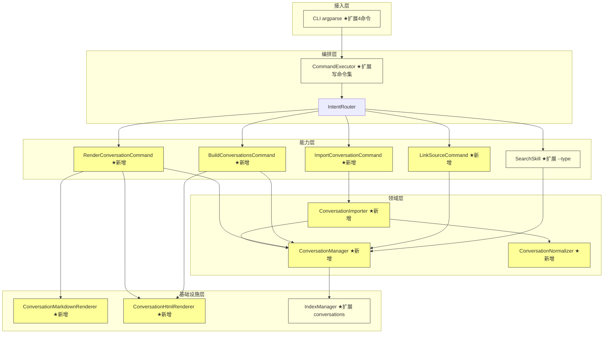
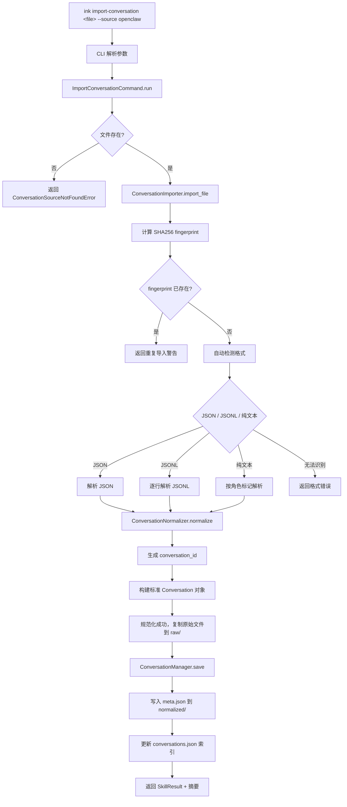
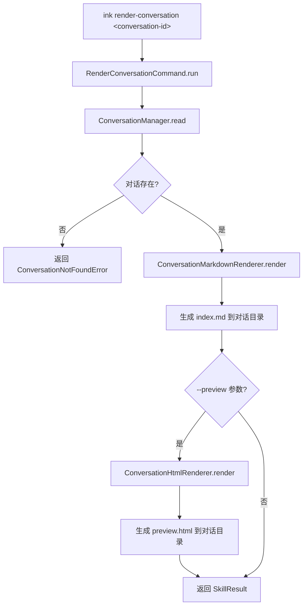

# 设计文档：Conversation Processing MVP（ink-node-conversation）

## 概述

InkBlog Node v0.5.0 引入 Conversation 作为第二内容类型，实现本地 AI/Agent 对话缓存的导入、规范化、Markdown/HTML 渲染、来源链接和搜索扩展。

本设计在现有五层架构中新增 `ink_core/conversation/` 包，保持与 Article 体系的隔离。所有对话数据存储于 `_node/conversations/` 目录，遵循 FS-as-DB 哲学。`meta.json` 是对话的唯一真相源，`index.md` 和 HTML 均为派生产物。

### 关键设计决策

| 决策 | 选择 | 理由 |
|------|------|------|
| 对话模块位置 | 新建 `ink_core/conversation/` 包 | 隔离对话逻辑，避免污染现有 Article 体系 |
| 对话存储根目录 | `_node/conversations/` | 与 Article 的 `YYYY/MM/` 目录完全分离，Blog-first 原则 |
| 对话 ID 格式 | `YYYY/MM/DD-<source>-<session-slug>` | Hub-ready，路径即 ID，与 Article canonical ID 风格一致 |
| 目录路径语义 | normalized 叶目录 = `DD-<source>-<slug>`，`_site` 叶目录 = `YYYY-MM-DD-<source>-<slug>` | 源数据路径与展示路径分离 |
| 格式检测策略 | 先 JSON → 再 JSONL → 最后纯文本 | 结构化优先，减少误判 |
| 重复检测 | SHA256 fingerprint 全局扫描 | 跨路径去重，不依赖文件名 |
| HTML 渲染 | Jinja2 + autoescape + `render_markdown()` | 复用 v0.4.0 基础设施，XSS 安全 |
| 搜索扩展 | `--type` 参数分流，不引入统一模型 | v0.5.0 最小侵入，v0.7.0 再做统一 |
| 构建隔离 | `ink build-conversations` 独立命令 | 不改变 `ink build` 博客主链路 |
| 索引管理 | `_index/conversations.json` 独立索引 | 与 `timeline.json` 并行，不混合 |
| 渲染职责分离 | `render-conversation` 只生成 Markdown（可选 preview.html），`build-conversations` 生成 `_site/` 下的 `index.html` | 避免两处同时写 HTML 造成混淆 |
| Session Slug | 复用 `SlugResolver` 无状态逻辑 | 中文标题生成拼音 slug，与 Article slug 行为一致 |
| 索引重建 | `_rebuild_index()` 同时扫描 Article frontmatter 恢复 `linked_articles` | `linked_articles` 是派生关系，不存储在 meta.json 中 |

---

## 架构

### 变更影响范围



黄色 = 新增组件，浅黄色 = 需修改的现有组件。

### 模块在五层架构中的位置

```
┌─────────────────────────────────────────────────────────────┐
│                     接入层 (Interface)                       │
│  CLI argparse ★ +4 子命令                                   │
│  (import-conversation, render-conversation,                 │
│   build-conversations, link-source)                         │
├─────────────────────────────────────────────────────────────┤
│                     编排层 (Orchestration)                   │
│  CommandExecutor ★ _WRITE_COMMANDS 扩展                     │
│  IntentRouter（不变，新命令注册为 BuiltinCommand）            │
├─────────────────────────────────────────────────────────────┤
│                     能力层 (Capabilities)                    │
│  ★ ImportConversationCommand(BuiltinCommand)                │
│  ★ RenderConversationCommand(BuiltinCommand)                │
│  ★ BuildConversationsCommand(BuiltinCommand)                │
│  ★ LinkSourceCommand(BuiltinCommand)                        │
│  SearchSkill ★ 扩展 --type conversation/all                 │
├─────────────────────────────────────────────────────────────┤
│                     领域层 (Domain)                          │
│  ★ ConversationManager    — 对话 CRUD + 路径解析 + 索引     │
│  ★ ConversationImporter   — 文件读取 + 格式检测 + 去重      │
│  ★ ConversationNormalizer — 多格式 → 标准 Conversation      │
├─────────────────────────────────────────────────────────────┤
│                     基础设施层 (Infrastructure)              │
│  ★ ConversationMarkdownRenderer — Conversation → index.md   │
│  ★ ConversationHtmlRenderer     — Conversation → index.html │
│  IndexManager ★ 扩展 conversations.json CRUD                │
└─────────────────────────────────────────────────────────────┘
```

### 数据流：对话导入全链路



### 数据流：对话渲染



> 注意：`render-conversation` 只生成 `index.md`（Markdown 归档）。可选 `--preview` 参数生成 `preview.html` 用于本地预览。`index.html` 由 `build-conversations` 统一生成到 `_site/`。

---

## 组件与接口

### 包结构

```
ink_core/
  conversation/
    __init__.py
    models.py              # Conversation, Message, ConversationStatus dataclass
    manager.py             # ConversationManager
    importer.py            # ConversationImporter
    normalizer.py          # ConversationNormalizer
    markdown_renderer.py   # ConversationMarkdownRenderer
    html_renderer.py       # ConversationHtmlRenderer
    commands.py            # 4 个 BuiltinCommand 子类
```

### 1. 数据模型 (`ink_core/conversation/models.py`)

```python
"""Conversation 数据模型。"""

from __future__ import annotations

from dataclasses import dataclass, field
from enum import Enum


class ConversationStatus(str, Enum):
    """对话生命周期状态。"""
    IMPORTED = "imported"   # 已导入未审阅
    ARCHIVED = "archived"   # 已归档

    @classmethod
    def is_valid(cls, status: str) -> bool:
        return status in {s.value for s in cls}


@dataclass
class Message:
    """对话中的单条消息。"""
    role: str                          # "user" | "assistant" | "system" | "unknown"
    content: str                       # 消息正文（允许空字符串）
    timestamp: str | None = None       # ISO 8601 时间戳（可选）
    metadata: dict = field(default_factory=dict)  # 扩展元数据（可选）


@dataclass
class Conversation:
    """标准 Conversation 对象，对应 meta.json。"""
    conversation_id: str               # YYYY/MM/DD-<source>-<session-slug>
    source: str                        # 来源标识（如 "openclaw"）
    source_file: str                   # 原始文件相对路径
    source_fingerprint: str            # 原始文件 SHA256
    title: str                         # 对话标题
    created_at: str                    # ISO 8601
    updated_at: str                    # ISO 8601
    participants: list[str]            # 参与者列表（非空）
    messages: list[Message]            # 消息列表（允许空）
    status: str = ConversationStatus.IMPORTED.value
    assets: list[str] = field(default_factory=list)

    def to_dict(self) -> dict:
        """序列化为可 JSON 化的字典。"""
        return {
            "conversation_id": self.conversation_id,
            "source": self.source,
            "source_file": self.source_file,
            "source_fingerprint": self.source_fingerprint,
            "title": self.title,
            "created_at": self.created_at,
            "updated_at": self.updated_at,
            "participants": self.participants,
            "messages": [
                {
                    "role": m.role,
                    "content": m.content,
                    **({"timestamp": m.timestamp} if m.timestamp else {}),
                    **({"metadata": m.metadata} if m.metadata else {}),
                }
                for m in self.messages
            ],
            "status": self.status,
            "assets": self.assets,
        }

    @classmethod
    def from_dict(cls, data: dict) -> Conversation:
        """从字典反序列化。"""
        messages = [
            Message(
                role=m["role"],
                content=m["content"],
                timestamp=m.get("timestamp"),
                metadata=m.get("metadata", {}),
            )
            for m in data.get("messages", [])
        ]
        return cls(
            conversation_id=data["conversation_id"],
            source=data["source"],
            source_file=data["source_file"],
            source_fingerprint=data["source_fingerprint"],
            title=data["title"],
            created_at=data["created_at"],
            updated_at=data["updated_at"],
            participants=data["participants"],
            messages=messages,
            status=data.get("status", ConversationStatus.IMPORTED.value),
            assets=data.get("assets", []),
        )
```

### 2. ConversationManager (`ink_core/conversation/manager.py`)

```python
"""对话 CRUD、路径解析、索引管理。"""

from __future__ import annotations

import json
from pathlib import Path

from ink_core.conversation.models import Conversation


class ConversationManager:
    """对话管理器，负责 CRUD + 路径解析 + 索引同步。"""

    def __init__(self, workspace_root: Path) -> None:
        self._workspace_root = workspace_root
        self._normalized_root = workspace_root / "_node" / "conversations" / "normalized"
        self._raw_root = workspace_root / "_node" / "conversations" / "raw"
        self._index_path = workspace_root / "_index" / "conversations.json"

    def ensure_dirs(self) -> None:
        """确保 _node/conversations/ 目录结构存在。"""
        self._normalized_root.mkdir(parents=True, exist_ok=True)
        self._raw_root.mkdir(parents=True, exist_ok=True)

    def resolve_path(self, conversation_id: str) -> Path:
        """将 conversation_id 解析为对话目录绝对路径。

        conversation_id 格式: YYYY/MM/DD-<source>-<session-slug>
        映射到: _node/conversations/normalized/YYYY/MM/DD-<source>-<session-slug>/
        """
        return self._normalized_root / Path(conversation_id)

    def save(self, conversation: Conversation) -> Path:
        """将 Conversation 对象持久化为 meta.json。

        Returns:
            对话目录的绝对路径。
        """
        conv_dir = self.resolve_path(conversation.conversation_id)
        conv_dir.mkdir(parents=True, exist_ok=True)
        (conv_dir / "assets").mkdir(exist_ok=True)

        meta_path = conv_dir / "meta.json"
        meta_path.write_text(
            json.dumps(conversation.to_dict(), ensure_ascii=False, indent=2),
            encoding="utf-8",
        )
        return conv_dir

    def read(self, conversation_id: str) -> Conversation:
        """根据 conversation_id 读取 Conversation 对象。

        Raises:
            ConversationNotFoundError: 对话目录或 meta.json 不存在。
        """
        from ink_core.core.errors import ConversationNotFoundError

        conv_dir = self.resolve_path(conversation_id)
        meta_path = conv_dir / "meta.json"
        if not meta_path.exists():
            raise ConversationNotFoundError(
                f"Conversation not found: {conversation_id}"
            )
        data = json.loads(meta_path.read_text(encoding="utf-8"))
        return Conversation.from_dict(data)

    def list_all(self, *, source: str | None = None) -> list[dict]:
        """返回所有对话的摘要列表。

        优先从 _index/conversations.json 读取；
        若索引不存在，扫描 normalized/ 目录重建。

        Args:
            source: 可选来源过滤。
        """
        entries = self._read_index()
        if not entries:
            entries = self._rebuild_index()
        if source:
            entries = [e for e in entries if e.get("source") == source]
        return entries

    def update_index(self, conversation: Conversation) -> None:
        """Upsert 对话条目到 conversations.json。"""
        entries = self._read_index()
        new_entry = {
            "conversation_id": conversation.conversation_id,
            "source": conversation.source,
            "title": conversation.title,
            "created_at": conversation.created_at,
            "message_count": len(conversation.messages),
            "status": conversation.status,
            "linked_articles": [],
        }

        # Upsert
        updated = False
        for i, e in enumerate(entries):
            if e.get("conversation_id") == conversation.conversation_id:
                # 保留已有的 linked_articles
                new_entry["linked_articles"] = e.get("linked_articles", [])
                entries[i] = new_entry
                updated = True
                break
        if not updated:
            entries.append(new_entry)

        # 按 created_at 倒序
        entries.sort(key=lambda e: e.get("created_at", ""), reverse=True)
        self._write_index(entries)

    def update_linked_articles(
        self, conversation_id: str, article_id: str
    ) -> None:
        """向对话索引条目的 linked_articles 添加文章 ID。"""
        entries = self._read_index()
        for e in entries:
            if e.get("conversation_id") == conversation_id:
                linked = e.get("linked_articles", [])
                if article_id not in linked:
                    linked.append(article_id)
                    e["linked_articles"] = linked
                break
        self._write_index(entries)

    def fingerprint_exists(self, fingerprint: str) -> str | None:
        """检查 fingerprint 是否已存在于任何已导入对话中。

        Returns:
            已存在的 conversation_id，或 None。
        """
        entries = self._read_index()
        # 索引中不存 fingerprint，需扫描 meta.json
        for year_dir in sorted(self._normalized_root.iterdir()) if self._normalized_root.exists() else []:
            if not year_dir.is_dir():
                continue
            for month_dir in sorted(year_dir.iterdir()):
                if not month_dir.is_dir():
                    continue
                for conv_dir in sorted(month_dir.iterdir()):
                    meta_path = conv_dir / "meta.json"
                    if not meta_path.exists():
                        continue
                    try:
                        data = json.loads(meta_path.read_text(encoding="utf-8"))
                        if data.get("source_fingerprint") == fingerprint:
                            return data.get("conversation_id")
                    except Exception:
                        continue
        return None

    # ------------------------------------------------------------------
    # 内部方法
    # ------------------------------------------------------------------

    def _read_index(self) -> list[dict]:
        if not self._index_path.exists():
            return []
        content = self._index_path.read_text(encoding="utf-8").strip()
        if not content:
            return []
        return json.loads(content)

    def _write_index(self, entries: list[dict]) -> None:
        self._index_path.parent.mkdir(parents=True, exist_ok=True)
        self._index_path.write_text(
            json.dumps(entries, ensure_ascii=False, indent=2),
            encoding="utf-8",
        )

    def _rebuild_index(self) -> list[dict]:
        """扫描 normalized/ 目录重建索引。

        重建过程还会扫描所有 Article frontmatter 的 source_conversations 字段，
        反向恢复每个对话的 linked_articles 关系（因为 linked_articles 是派生数据，
        不存储在 meta.json 中）。
        """
        entries: list[dict] = []
        if not self._normalized_root.exists():
            return entries
        for year_dir in sorted(self._normalized_root.iterdir()):
            if not year_dir.is_dir():
                continue
            for month_dir in sorted(year_dir.iterdir()):
                if not month_dir.is_dir():
                    continue
                for conv_dir in sorted(month_dir.iterdir()):
                    meta_path = conv_dir / "meta.json"
                    if not meta_path.exists():
                        continue
                    try:
                        conv = Conversation.from_dict(
                            json.loads(meta_path.read_text(encoding="utf-8"))
                        )
                        entries.append({
                            "conversation_id": conv.conversation_id,
                            "source": conv.source,
                            "title": conv.title,
                            "created_at": conv.created_at,
                            "message_count": len(conv.messages),
                            "status": conv.status,
                            "linked_articles": [],
                        })
                    except Exception:
                        continue

        # 反向恢复 linked_articles：扫描所有 Article frontmatter
        conv_id_to_articles: dict[str, list[str]] = {}
        self._scan_article_source_links(conv_id_to_articles)
        for entry in entries:
            cid = entry["conversation_id"]
            if cid in conv_id_to_articles:
                entry["linked_articles"] = conv_id_to_articles[cid]

        entries.sort(key=lambda e: e.get("created_at", ""), reverse=True)
        self._write_index(entries)
        return entries

    def _scan_article_source_links(
        self, conv_id_to_articles: dict[str, list[str]]
    ) -> None:
        """扫描所有 Article 的 index.md frontmatter，提取 source_conversations 字段，
        构建 conversation_id → [article_id] 的反向映射。"""
        from ink_core.fs.article import ArticleManager

        try:
            article_mgr = ArticleManager(self._workspace_root)
            all_articles = article_mgr.list_all()
        except Exception:
            return

        for article_summary in all_articles:
            try:
                article_id = article_summary.get("canonical_id", "")
                article_path = article_summary.get("path")
                if not article_path:
                    continue
                index_md = Path(article_path) / "index.md"
                if not index_md.exists():
                    continue
                from ink_core.fs.markdown import parse_frontmatter
                meta, _ = parse_frontmatter(index_md.read_text(encoding="utf-8"))
                source_convs = meta.get("source_conversations", [])
                if isinstance(source_convs, list):
                    for cid in source_convs:
                        if cid not in conv_id_to_articles:
                            conv_id_to_articles[cid] = []
                        if article_id not in conv_id_to_articles[cid]:
                            conv_id_to_articles[cid].append(article_id)
            except Exception:
                continue
```


### 3. ConversationImporter (`ink_core/conversation/importer.py`)

```python
"""对话导入：文件读取 + 格式检测 + SHA256 去重。"""

from __future__ import annotations

import hashlib
import json
import shutil
from pathlib import Path

from ink_core.conversation.models import Conversation, Message
from ink_core.conversation.normalizer import ConversationNormalizer
from ink_core.conversation.manager import ConversationManager
from ink_core.skills.base import SkillResult


class ConversationImporter:
    """读取本地缓存文件，自动检测格式，调用 Normalizer 生成标准对象。"""

    SUPPORTED_FORMATS = ["json", "jsonl", "text"]

    def __init__(self, workspace_root: Path) -> None:
        self._workspace_root = workspace_root
        self._manager = ConversationManager(workspace_root)
        self._normalizer = ConversationNormalizer()

    def import_file(
        self,
        file_path: Path,
        *,
        source: str = "unknown",
        title: str | None = None,
    ) -> SkillResult:
        """导入单个对话缓存文件。

        Args:
            file_path: 本地文件绝对路径。
            source: 来源标识。
            title: 可选标题，未指定时从内容提取。

        Returns:
            SkillResult，data 包含 conversation_id、message_count 等。
        """
        from ink_core.core.errors import PathNotFoundError

        # 1. 文件存在性检查
        if not file_path.exists():
            return SkillResult(
                success=False,
                message=f"File not found: {file_path}",
                data={"error_type": "ConversationSourceNotFoundError", "path": str(file_path)},
            )

        # 2. 计算 SHA256 fingerprint
        content_bytes = file_path.read_bytes()
        fingerprint = hashlib.sha256(content_bytes).hexdigest()

        # 3. 重复检测
        existing_id = self._manager.fingerprint_exists(fingerprint)
        if existing_id:
            return SkillResult(
                success=False,
                message=f"Duplicate import: file already imported as {existing_id}",
                data={
                    "error_type": "ConversationDuplicateImportError",
                    "existing_conversation_id": existing_id,
                    "fingerprint": fingerprint,
                },
            )

        # 4. 格式检测 + 解析
        content_str = content_bytes.decode("utf-8", errors="replace")
        detected_format, raw_data = self._detect_and_parse(content_str)
        if detected_format is None:
            return SkillResult(
                success=False,
                message=f"Cannot detect format. Supported: {', '.join(self.SUPPORTED_FORMATS)}",
                data={"error_type": "ConversationFormatDetectionError"},
            )

        # 5. 确保目录结构
        self._manager.ensure_dirs()

        # 6. 规范化（先于 raw 复制，避免规范化失败时留下孤立的 raw 副本）
        source_file_rel_placeholder = f"_node/conversations/raw/{source}/{file_path.name}"
        conversation = self._normalizer.normalize(
            raw_data=raw_data,
            source_format=detected_format,
            source=source,
            source_file=source_file_rel_placeholder,
            source_fingerprint=fingerprint,
            title=title,
        )

        # 7. 规范化成功后，复制原始文件到 raw/
        raw_dir = self._workspace_root / "_node" / "conversations" / "raw" / source
        raw_dir.mkdir(parents=True, exist_ok=True)
        raw_dest = raw_dir / file_path.name
        shutil.copy2(file_path, raw_dest)

        # 8. 持久化（失败时清理 raw 副本）
        try:
            conv_dir = self._manager.save(conversation)
        except Exception:
            raw_dest.unlink(missing_ok=True)
            raise

        # 9. 更新索引（失败时清理 raw 副本和半成品目录）
        try:
            self._manager.update_index(conversation)
        except Exception:
            raw_dest.unlink(missing_ok=True)
            shutil.rmtree(conv_dir, ignore_errors=True)
            raise

        changed_files = [
            conv_dir / "meta.json",
            raw_dest,
            self._workspace_root / "_index" / "conversations.json",
        ]

        return SkillResult(
            success=True,
            message=f"Imported conversation: {conversation.conversation_id} ({len(conversation.messages)} messages)",
            data={
                "conversation_id": conversation.conversation_id,
                "message_count": len(conversation.messages),
                "source": conversation.source,
                "path": str(conv_dir),
            },
            changed_files=[p for p in changed_files if p.exists()],
        )

    def _detect_and_parse(self, content: str) -> tuple[str | None, list | dict | None]:
        """自动检测文件格式并解析。

        检测顺序：JSON → JSONL → 纯文本。

        Returns:
            (format_name, parsed_data) 或 (None, None)。
        """
        # 尝试 JSON
        try:
            data = json.loads(content)
            if isinstance(data, (dict, list)):
                return "json", data
        except (json.JSONDecodeError, ValueError):
            pass

        # 尝试 JSONL
        lines = [l.strip() for l in content.strip().splitlines() if l.strip()]
        if lines:
            jsonl_records = []
            all_valid = True
            for line in lines:
                try:
                    jsonl_records.append(json.loads(line))
                except (json.JSONDecodeError, ValueError):
                    all_valid = False
                    break
            if all_valid and jsonl_records:
                return "jsonl", jsonl_records

        # 尝试纯文本
        if content.strip():
            return "text", content

        return None, None
```

### 4. ConversationNormalizer (`ink_core/conversation/normalizer.py`)

```python
"""多格式对话数据 → 标准 Conversation 对象。"""

from __future__ import annotations

import re
from datetime import datetime

from ink_core.conversation.models import Conversation, ConversationStatus, Message


class ConversationNormalizer:
    """将不同源格式的解析结果转换为标准 Conversation 对象。"""

    def normalize(
        self,
        raw_data: list | dict | str,
        source_format: str,
        source: str,
        source_file: str,
        source_fingerprint: str,
        title: str | None = None,
    ) -> Conversation:
        """规范化入口。

        Args:
            raw_data: 解析后的原始数据。
            source_format: "json" | "jsonl" | "text"。
            source: 来源标识。
            source_file: 原始文件相对路径。
            source_fingerprint: SHA256 哈希。
            title: 可选标题。

        Returns:
            标准 Conversation 对象。
        """
        if source_format == "json":
            messages, extracted_meta = self._normalize_json(raw_data)
        elif source_format == "jsonl":
            messages, extracted_meta = self._normalize_jsonl(raw_data)
        elif source_format == "text":
            messages, extracted_meta = self._normalize_text(raw_data)
        else:
            messages, extracted_meta = [], {}

        # 提取时间戳
        now_iso = datetime.now().isoformat(timespec="seconds")
        created_at = extracted_meta.get("created_at") or now_iso
        updated_at = extracted_meta.get("updated_at") or now_iso

        # 提取参与者
        participants = extracted_meta.get("participants")
        if not participants:
            roles = list(dict.fromkeys(m.role for m in messages if m.role))
            participants = roles if roles else ["user", "assistant"]

        # 生成标题
        if not title:
            title = self._extract_title(messages)

        # 生成 conversation_id
        date_str = created_at[:10]  # YYYY-MM-DD
        session_slug = self._generate_session_slug(title)
        year, month, day = date_str.split("-")
        conversation_id = f"{year}/{month}/{day}-{source}-{session_slug}"

        return Conversation(
            conversation_id=conversation_id,
            source=source,
            source_file=source_file,
            source_fingerprint=source_fingerprint,
            title=title,
            created_at=created_at,
            updated_at=updated_at,
            participants=participants,
            messages=messages,
            status=ConversationStatus.IMPORTED.value,
        )

    def _normalize_json(self, data: dict | list) -> tuple[list[Message], dict]:
        """规范化 JSON 格式数据。"""
        meta: dict = {}
        messages: list[Message] = []

        if isinstance(data, dict):
            # 单个对话对象
            raw_messages = data.get("messages", [])
            meta["created_at"] = data.get("created_at") or data.get("create_time")
            meta["updated_at"] = data.get("updated_at") or data.get("update_time")
            meta["participants"] = data.get("participants")
            for m in raw_messages:
                messages.append(self._normalize_message(m))
        elif isinstance(data, list):
            # 消息数组
            for item in data:
                if isinstance(item, dict):
                    messages.append(self._normalize_message(item))
        return messages, meta

    def _normalize_jsonl(self, records: list) -> tuple[list[Message], dict]:
        """规范化 JSONL 格式数据（每行一条消息）。"""
        messages: list[Message] = []
        for record in records:
            if isinstance(record, dict):
                messages.append(self._normalize_message(record))
        return messages, {}

    def _normalize_text(self, text: str) -> tuple[list[Message], dict]:
        """规范化纯文本格式。

        支持的角色标记：User: / Assistant: / System:
        无标记时按交替顺序分配 user/assistant。
        """
        messages: list[Message] = []
        # 尝试按角色标记分割
        pattern = re.compile(
            r"^(User|Assistant|System|Human|AI|Bot)\s*:\s*",
            re.IGNORECASE | re.MULTILINE,
        )
        parts = pattern.split(text)

        if len(parts) > 1:
            # 有角色标记
            # parts: [前缀, role1, content1, role2, content2, ...]
            i = 1
            while i < len(parts) - 1:
                role = self._map_role(parts[i])
                content = parts[i + 1].strip()
                messages.append(Message(role=role, content=content))
                i += 2
        else:
            # 无角色标记，按空行分割，交替分配
            blocks = re.split(r"\n\s*\n", text.strip())
            roles = ["user", "assistant"]
            for idx, block in enumerate(blocks):
                block = block.strip()
                if block:
                    messages.append(
                        Message(role=roles[idx % 2], content=block)
                    )
        return messages, {}

    def _normalize_message(self, data: dict) -> Message:
        """将单条原始消息字典规范化为 Message。"""
        role = data.get("role") or data.get("author") or data.get("sender") or "unknown"
        role = self._map_role(role)
        content = str(data.get("content", data.get("text", data.get("body", ""))))
        timestamp = data.get("timestamp") or data.get("created_at") or data.get("time")
        metadata = {
            k: v for k, v in data.items()
            if k not in ("role", "author", "sender", "content", "text",
                         "body", "timestamp", "created_at", "time")
        }
        return Message(
            role=role,
            content=content,
            timestamp=str(timestamp) if timestamp else None,
            metadata=metadata if metadata else {},
        )

    def _map_role(self, role: str) -> str:
        """将各种角色名映射到标准角色。"""
        role_lower = role.strip().lower()
        mapping = {
            "user": "user",
            "human": "user",
            "assistant": "assistant",
            "ai": "assistant",
            "bot": "assistant",
            "system": "system",
        }
        return mapping.get(role_lower, role_lower or "unknown")

    def _extract_title(self, messages: list[Message]) -> str:
        """从消息列表提取标题（首条消息前 50 字符）。"""
        for m in messages:
            if m.content.strip():
                title = m.content.strip()[:50]
                # 去除换行
                title = title.replace("\n", " ").strip()
                return title
        return "Untitled Conversation"

    def _generate_session_slug(self, title: str) -> str:
        """从标题生成 session slug。

        复用 SlugResolver 的无状态 slug 生成逻辑（仅"标题→slug"部分），
        不引入 workspace 路径冲突检测语义。确保中文标题也能生成
        友好的拼音 slug（与 Article slug 行为一致），而非退化为 hash 形式。
        """
        from ink_core.fs.article import SlugResolver
        from pathlib import Path

        # 使用 SlugResolver 的 generate_slug 方法（workspace_root 仅用于冲突检测，
        # 此处不需要冲突检测，传入一个占位路径即可）
        resolver = SlugResolver(Path("."))
        slug = resolver.generate_slug(title)

        # SlugResolver 可能生成 "post-xxxxxxxx" 形式的 hash slug，
        # 对 conversation 场景改为 "session-" 前缀
        if slug.startswith("post-"):
            slug = "session-" + slug[5:]

        # 截断到合理长度
        return slug[:40]
```

### 5. ConversationMarkdownRenderer (`ink_core/conversation/markdown_renderer.py`)

```python
"""Conversation → Markdown index.md 渲染。"""

from __future__ import annotations

import yaml

from ink_core.conversation.models import Conversation


class ConversationMarkdownRenderer:
    """将标准 Conversation 对象渲染为 Markdown 归档文件。"""

    def render(self, conversation: Conversation) -> str:
        """渲染 Conversation 为 Markdown 字符串。

        输出格式：
        - YAML frontmatter（title, conversation_id, source, created_at,
          participants, message_count, status）
        - 正文按时间顺序渲染每条消息

        Returns:
            完整的 Markdown 文件内容。
        """
        frontmatter = {
            "title": conversation.title,
            "conversation_id": conversation.conversation_id,
            "source": conversation.source,
            "created_at": conversation.created_at,
            "participants": conversation.participants,
            "message_count": len(conversation.messages),
            "status": conversation.status,
        }
        yaml_str = yaml.dump(
            frontmatter,
            allow_unicode=True,
            default_flow_style=False,
            sort_keys=False,
        )

        parts: list[str] = [f"---\n{yaml_str}---\n"]
        parts.append(f"# {conversation.title}\n")

        for msg in conversation.messages:
            role_label = self._role_display(msg.role)
            if msg.timestamp:
                parts.append(f"### {role_label} — {msg.timestamp}\n")
            else:
                parts.append(f"### {role_label}\n")
            parts.append(f"{msg.content}\n")

        return "\n".join(parts)

    def _role_display(self, role: str) -> str:
        """将角色标识转换为显示名称。"""
        mapping = {
            "user": "👤 User",
            "assistant": "🤖 Assistant",
            "system": "⚙️ System",
        }
        return mapping.get(role, role.capitalize())
```

### 6. ConversationHtmlRenderer (`ink_core/conversation/html_renderer.py`)

```python
"""Conversation → 静态 HTML 页面渲染。"""

from __future__ import annotations

from pathlib import Path

import jinja2
from markupsafe import Markup

from ink_core.conversation.models import Conversation
from ink_core.fs.markdown_renderer import render_markdown


# 内置默认对话 HTML 模板
_DEFAULT_CONVERSATION_TEMPLATE = """\
<!DOCTYPE html>
<html lang="zh-CN">
<head>
    <meta charset="UTF-8">
    <meta name="viewport" content="width=device-width, initial-scale=1.0">
    <title>{{ title }} - {{ site_title }}</title>
    <style>
        * { margin: 0; padding: 0; box-sizing: border-box; }
        body {
            font-family: -apple-system, BlinkMacSystemFont, "Segoe UI", Roboto, sans-serif;
            line-height: 1.8; color: #333; max-width: 800px;
            margin: 0 auto; padding: 2rem 1rem; background: #fafafa;
        }
        nav { margin-bottom: 2rem; }
        nav a { color: #3498db; text-decoration: none; font-size: 0.9rem; }
        .conv-header { margin-bottom: 2rem; padding-bottom: 1rem; border-bottom: 2px solid #e0e0e0; }
        .conv-header h1 { font-size: 1.8rem; color: #2c3e50; margin-bottom: 0.5rem; }
        .conv-meta { font-size: 0.85rem; color: #999; display: flex; gap: 1rem; flex-wrap: wrap; }
        .message { margin-bottom: 1.5rem; padding: 1rem; border-radius: 8px; }
        .message-user { background: #e8f4fd; border-left: 4px solid #3498db; }
        .message-assistant { background: #f0f8f0; border-left: 4px solid #27ae60; }
        .message-system { background: #fff8e1; border-left: 4px solid #f39c12; }
        .message-unknown { background: #f5f5f5; border-left: 4px solid #999; }
        .message-role { font-weight: 600; font-size: 0.9rem; margin-bottom: 0.5rem; color: #555; }
        .message-time { font-size: 0.8rem; color: #999; margin-left: 0.5rem; }
        .message-content { line-height: 1.7; }
        .message-content pre { background: #1e1e1e; color: #d4d4d4; padding: 1rem;
            border-radius: 6px; overflow-x: auto; margin: 0.5rem 0; font-size: 0.9rem; }
        .message-content code { background: #f0f0f0; padding: 0.1rem 0.3rem;
            border-radius: 3px; font-size: 0.9em; }
        .message-content pre code { background: none; padding: 0; color: inherit; }
        footer { text-align: center; padding: 3rem 0; color: #999; font-size: 0.9rem;
            border-top: 1px solid #e0e0e0; margin-top: 3rem; }
    </style>
</head>
<body>
    <nav><a href="../../../../index.html">← 返回首页</a></nav>
    <div class="conv-header">
        <h1>{{ title }}</h1>
        <div class="conv-meta">
            <span>📅 {{ created_at }}</span>
            <span>💬 {{ message_count }} 条消息</span>
            <span>📌 {{ source }}</span>
            <span>👥 {{ participants | join(", ") }}</span>
        </div>
    </div>
    
    <div class="message message-{{ msg.role }}">
        <div class="message-role">
            {{ msg.role_display }}
            <span class="message-time">{{ msg.timestamp }}</span>
        </div>
        <div class="message-content">{{ msg.content_html }}</div>
    </div>
    
    <footer><p>🍪 使用 InkBlog Node 构建</p></footer>
</body>
</html>
"""


class ConversationHtmlRenderer:
    """将 Conversation 渲染为静态 HTML 页面。"""

    TEMPLATE_DIR = "_templates/site"
    TEMPLATE_NAME = "conversation.html"

    def __init__(self, workspace_root: Path) -> None:
        self._workspace_root = workspace_root

    def render(self, conversation: Conversation, site_title: str = "Blog") -> str:
        """渲染 Conversation 为 HTML 字符串。

        Args:
            conversation: 标准 Conversation 对象。
            site_title: 站点标题。

        Returns:
            完整的 HTML 页面内容。
        """
        messages_ctx = []
        for msg in conversation.messages:
            content_html = Markup(render_markdown(msg.content, safe=True))
            role_display = self._role_display(msg.role)
            messages_ctx.append({
                "role": msg.role,
                "role_display": role_display,
                "content_html": content_html,
                "timestamp": msg.timestamp or "",
            })

        ctx = {
            "title": conversation.title,
            "site_title": site_title,
            "source": conversation.source,
            "created_at": conversation.created_at,
            "participants": conversation.participants,
            "message_count": len(conversation.messages),
            "messages": messages_ctx,
            "conversation_id": conversation.conversation_id,
        }

        return self._render_template(ctx)

    def render_to_file(
        self, conversation: Conversation, output_path: Path, site_title: str = "Blog"
    ) -> None:
        """渲染并写入文件。"""
        html = self.render(conversation, site_title=site_title)
        output_path.parent.mkdir(parents=True, exist_ok=True)
        output_path.write_text(html, encoding="utf-8")

    def _render_template(self, ctx: dict) -> str:
        user_template = self._workspace_root / self.TEMPLATE_DIR / self.TEMPLATE_NAME
        if user_template.exists():
            env = jinja2.Environment(
                loader=jinja2.FileSystemLoader(
                    str(self._workspace_root / self.TEMPLATE_DIR)
                ),
                autoescape=True,
            )
            tmpl = env.get_template(self.TEMPLATE_NAME)
        else:
            env = jinja2.Environment(
                loader=jinja2.BaseLoader(), autoescape=True
            )
            tmpl = env.from_string(_DEFAULT_CONVERSATION_TEMPLATE)
        return tmpl.render(**ctx)

    def _role_display(self, role: str) -> str:
        mapping = {
            "user": "👤 User",
            "assistant": "🤖 Assistant",
            "system": "⚙️ System",
        }
        return mapping.get(role, role.capitalize())
```


### 7. CLI 命令 (`ink_core/conversation/commands.py`)

```python
"""对话相关的 4 个 BuiltinCommand。"""

from __future__ import annotations

from pathlib import Path

from ink_core.cli.builtin import BuiltinCommand
from ink_core.skills.base import SkillResult


class ImportConversationCommand(BuiltinCommand):
    """ink import-conversation <file> [--source] [--title]"""

    def __init__(self, workspace_root: Path) -> None:
        self._workspace_root = workspace_root

    @property
    def name(self) -> str:
        return "import-conversation"

    def run(self, target: str | None, params: dict) -> SkillResult:
        from ink_core.conversation.importer import ConversationImporter

        file_path = Path(target) if target else None
        if not file_path:
            return SkillResult(success=False, message="File path is required.")

        if not file_path.is_absolute():
            file_path = self._workspace_root / file_path

        importer = ConversationImporter(self._workspace_root)
        return importer.import_file(
            file_path,
            source=params.get("source", "unknown"),
            title=params.get("title"),
        )


class RenderConversationCommand(BuiltinCommand):
    """ink render-conversation <conversation-id> [--preview]"""

    def __init__(self, workspace_root: Path) -> None:
        self._workspace_root = workspace_root

    @property
    def name(self) -> str:
        return "render-conversation"

    def run(self, target: str | None, params: dict) -> SkillResult:
        from ink_core.conversation.manager import ConversationManager
        from ink_core.conversation.markdown_renderer import ConversationMarkdownRenderer
        from ink_core.conversation.html_renderer import ConversationHtmlRenderer
        from ink_core.core.errors import ConversationNotFoundError

        if not target:
            return SkillResult(success=False, message="Conversation ID is required.")

        manager = ConversationManager(self._workspace_root)
        try:
            conversation = manager.read(target)
        except ConversationNotFoundError as e:
            return SkillResult(success=False, message=str(e))

        conv_dir = manager.resolve_path(target)
        changed: list[Path] = []

        # Markdown 渲染（始终生成）
        md_renderer = ConversationMarkdownRenderer()
        md_content = md_renderer.render(conversation)
        md_path = conv_dir / "index.md"
        md_path.write_text(md_content, encoding="utf-8")
        changed.append(md_path)

        # HTML 预览（仅当 --preview 时生成 preview.html，不生成 index.html）
        preview = bool(params.get("preview", False))
        output_label = "Markdown"
        if preview:
            html_renderer = ConversationHtmlRenderer(self._workspace_root)
            preview_path = conv_dir / "preview.html"
            html_renderer.render_to_file(conversation, preview_path)
            changed.append(preview_path)
            output_label = "Markdown + preview HTML"

        return SkillResult(
            success=True,
            message=f"Rendered conversation: {target} ({output_label})",
            data={"conversation_id": target},
            changed_files=changed,
        )


class BuildConversationsCommand(BuiltinCommand):
    """ink build-conversations — 批量生成对话静态 HTML。"""

    def __init__(self, workspace_root: Path) -> None:
        self._workspace_root = workspace_root

    @property
    def name(self) -> str:
        return "build-conversations"

    def run(self, target: str | None, params: dict) -> SkillResult:
        import time
        from ink_core.conversation.manager import ConversationManager
        from ink_core.conversation.html_renderer import ConversationHtmlRenderer
        from ink_core.core.config import InkConfig

        start = time.monotonic()
        manager = ConversationManager(self._workspace_root)
        entries = manager.list_all()

        if not entries:
            return SkillResult(
                success=True,
                message="No conversations to build.",
                data={"page_count": 0, "duration_ms": 0},
            )

        config = InkConfig(workspace_root=self._workspace_root)
        site_title = config.get("site.title", "Blog")
        output_base = self._workspace_root / "_site" / "conversations"
        renderer = ConversationHtmlRenderer(self._workspace_root)
        changed: list[Path] = []
        errors: list[str] = []
        page_count = 0

        for entry in entries:
            conv_id = entry.get("conversation_id", "")
            try:
                conversation = manager.read(conv_id)
                # 输出路径: _site/conversations/YYYY/MM/YYYY-MM-DD-<source>-<slug>/index.html
                # conversation_id = YYYY/MM/DD-<source>-<slug>
                parts = conv_id.split("/")  # ["YYYY", "MM", "DD-source-slug"]
                if len(parts) == 3:
                    year, month, slug_part = parts
                    dir_name = f"{year}-{month}-{slug_part}"
                    out_path = output_base / year / month / dir_name / "index.html"
                else:
                    out_path = output_base / conv_id / "index.html"

                renderer.render_to_file(conversation, out_path, site_title=site_title)
                changed.append(out_path)
                page_count += 1
            except Exception as e:
                errors.append(f"{conv_id}: {e}")

        duration_ms = int((time.monotonic() - start) * 1000)

        if errors:
            return SkillResult(
                success=False,
                message=f"Built {page_count} page(s) with {len(errors)} error(s) in {duration_ms}ms",
                data={"page_count": page_count, "duration_ms": duration_ms, "errors": errors},
                changed_files=changed,
            )

        return SkillResult(
            success=True,
            message=f"Built {page_count} conversation page(s) in {duration_ms}ms",
            data={"page_count": page_count, "duration_ms": duration_ms},
            changed_files=changed,
        )


class LinkSourceCommand(BuiltinCommand):
    """ink link-source <article-id> --conversation <conversation-id>"""

    def __init__(self, workspace_root: Path) -> None:
        self._workspace_root = workspace_root

    @property
    def name(self) -> str:
        return "link-source"

    def run(self, target: str | None, params: dict) -> SkillResult:
        from ink_core.conversation.manager import ConversationManager
        from ink_core.fs.article import ArticleManager
        from ink_core.fs.markdown import parse_frontmatter, dump_frontmatter
        from ink_core.core.errors import PathNotFoundError, ConversationNotFoundError

        article_id = target
        conversation_id = params.get("conversation")

        if not article_id:
            return SkillResult(success=False, message="Article ID is required.")
        if not conversation_id:
            return SkillResult(success=False, message="--conversation is required.")

        # 验证 Article 存在
        article_mgr = ArticleManager(self._workspace_root)
        try:
            article_result = article_mgr.read_by_id(article_id)
        except PathNotFoundError:
            return SkillResult(
                success=False,
                message=f"Article not found: {article_id}",
            )

        # 验证 Conversation 存在
        conv_mgr = ConversationManager(self._workspace_root)
        try:
            conv_mgr.read(conversation_id)
        except ConversationNotFoundError:
            return SkillResult(
                success=False,
                message=f"Conversation not found: {conversation_id}",
            )

        # 更新 Article frontmatter
        article = article_result.article
        index_path = article.path / "index.md"
        meta, body = parse_frontmatter(index_path.read_text(encoding="utf-8"))

        source_convs = meta.get("source_conversations", [])
        if not isinstance(source_convs, list):
            source_convs = []

        if conversation_id in source_convs:
            return SkillResult(
                success=True,
                message=f"Already linked: {article_id} ← {conversation_id}",
                data={"article_id": article_id, "conversation_id": conversation_id},
            )

        source_convs.append(conversation_id)
        meta["source_conversations"] = source_convs
        new_content = dump_frontmatter(meta, body)
        index_path.write_text(new_content, encoding="utf-8")

        # 更新 conversations.json 的 linked_articles
        conv_mgr.update_linked_articles(conversation_id, article_id)

        changed = [
            index_path,
            self._workspace_root / "_index" / "conversations.json",
        ]

        return SkillResult(
            success=True,
            message=f"Linked: {article_id} ← {conversation_id}",
            data={"article_id": article_id, "conversation_id": conversation_id},
            changed_files=[p for p in changed if p.exists()],
        )
```

### 8. CLI 注册 (`ink_core/cli/parser.py` 变更)

在 `_build_executor()` 中注册新命令：

```python
# 在 builtins dict 中新增：
from ink_core.conversation.commands import (
    ImportConversationCommand,
    RenderConversationCommand,
    BuildConversationsCommand,
    LinkSourceCommand,
)

builtins.update({
    "import-conversation": ImportConversationCommand(workspace_root),
    "render-conversation": RenderConversationCommand(workspace_root),
    "build-conversations": BuildConversationsCommand(workspace_root),
    "link-source": LinkSourceCommand(workspace_root),
})
```

在 `_build_arg_parser()` 中新增子命令：

```python
# ═══ 对话命令 ═══
p_import = sub.add_parser(
    "import-conversation", help="[对话] 导入本地对话缓存文件"
)
p_import.add_argument("file", help="对话缓存文件路径")
p_import.add_argument("--source", default="unknown", help="来源标识")
p_import.add_argument("--title", help="对话标题")

p_render = sub.add_parser(
    "render-conversation", help="[对话] 渲染对话为 Markdown（可选 HTML 预览）"
)
p_render.add_argument("conversation_id", help="Conversation ID")
p_render.add_argument("--preview", action="store_true", help="同时生成 preview.html 本地预览")

sub.add_parser(
    "build-conversations", help="[对话] 批量生成对话静态 HTML"
)

p_link = sub.add_parser(
    "link-source", help="[对话] 关联文章与来源对话"
)
p_link.add_argument("article_id", help="Article Canonical ID")
p_link.add_argument("--conversation", required=True, help="Conversation ID")
```

在 `_intent_from_namespace()` 中新增分支：

```python
elif cmd == "import-conversation":
    target = getattr(ns, "file", None)
    if getattr(ns, "source", None):
        params["source"] = ns.source
    if getattr(ns, "title", None):
        params["title"] = ns.title

elif cmd == "render-conversation":
    target = getattr(ns, "conversation_id", None)
    if getattr(ns, "preview", False):
        params["preview"] = True

elif cmd == "build-conversations":
    target = None

elif cmd == "link-source":
    target = getattr(ns, "article_id", None)
    if getattr(ns, "conversation", None):
        params["conversation"] = ns.conversation
```

在 `CommandExecutor._WRITE_COMMANDS` 中新增：

```python
_WRITE_COMMANDS = {
    "new", "init", "rebuild", "publish", "build",
    "import-conversation", "render-conversation",
    "build-conversations", "link-source",
}
```

### 9. SearchSkill 扩展 (`ink_core/skills/search.py` 变更)

> **重构前置步骤**：当前 `SearchSkill.execute()` 的 Article 搜索逻辑是内联实现的（没有独立的 `_search_articles()` 方法）。扩展 `--type` 分流前，需先将现有 Article 搜索逻辑提取为 `_search_articles()` 方法，然后再添加 `_search_conversations()` 和 `--type` 分发逻辑。

```python
# SearchSkill.execute() 扩展

def execute(self, target: str | None, params: dict) -> SkillResult:
    content_type = params.get("type")  # None | "conversation" | "all"

    if content_type == "conversation":
        return self._search_conversations(query, params)
    elif content_type == "all":
        article_result = self._search_articles(query, params)
        conv_result = self._search_conversations(query, params)
        return self._merge_results(query, article_result, conv_result)
    else:
        # 默认行为不变：仅搜索 Article
        return self._search_articles(query, params)

def _search_conversations(self, query: str, params: dict) -> SkillResult:
    """在对话 index.md 中执行关键词搜索。"""
    from ink_core.conversation.manager import ConversationManager
    from ink_core.fs.markdown import parse_frontmatter

    manager = ConversationManager(self._workspace_root)
    entries = manager.list_all()
    keywords = _tokenize(query)
    hits: list[dict] = []

    for entry in entries:
        conv_id = entry.get("conversation_id", "")
        conv_dir = manager.resolve_path(conv_id)
        md_path = conv_dir / "index.md"
        if not md_path.exists():
            continue

        text = md_path.read_text(encoding="utf-8")
        count = _count_hits(text, keywords)
        if count > 0:
            snippet = _extract_snippet(text, keywords)
            hits.append({
                "conversation_id": conv_id,
                "content_type": "conversation",
                "title": entry.get("title", ""),
                "snippet": snippet,
                "source": entry.get("source", ""),
                "score": float(count),
                "hit_count": count,
                "created_at": entry.get("created_at", ""),
            })

    # 按 hit_count 降序，created_at 降序
    hits.sort(key=lambda h: (h["hit_count"], h["created_at"]), reverse=True)

    if not hits:
        return SkillResult(
            success=True,
            message=f"No conversation results for '{query}'.",
            data={
                "query": query,
                "results": [],
                "suggestions": _generate_suggestions(query, keywords),
            },
        )

    return SkillResult(
        success=True,
        message=f"Found {len(hits)} conversation result(s) for '{query}'.",
        data={"query": query, "results": hits},
    )

def _merge_results(
    self, query: str, article_result: SkillResult, conv_result: SkillResult
) -> SkillResult:
    """合并 Article 和 Conversation 搜索结果。"""
    article_hits = (article_result.data or {}).get("results", [])
    conv_hits = (conv_result.data or {}).get("results", [])

    # 为 article 结果添加 content_type
    for h in article_hits:
        h["content_type"] = "article"

    merged = article_hits + conv_hits
    merged.sort(key=lambda h: h.get("score", 0), reverse=True)

    return SkillResult(
        success=True,
        message=f"Found {len(merged)} result(s) for '{query}' (articles + conversations).",
        data={"query": query, "results": merged},
    )
```

---

## 数据模型

### Conversation 对象（meta.json）

```json
{
  "conversation_id": "2026/04/11-openclaw-session-001",
  "source": "openclaw",
  "source_file": "_node/conversations/raw/openclaw/session-001.json",
  "source_fingerprint": "a1b2c3d4e5f6...sha256...",
  "title": "讨论 InkBlog Node 架构",
  "created_at": "2026-04-11T10:30:00",
  "updated_at": "2026-04-11T12:00:00",
  "participants": ["user", "assistant"],
  "messages": [
    {
      "role": "user",
      "content": "消息内容",
      "timestamp": "2026-04-11T10:30:00",
      "metadata": {}
    }
  ],
  "assets": [],
  "status": "imported"
}
```

### 字段约束

| 字段 | 类型 | 必填 | 约束 |
|------|------|------|------|
| `conversation_id` | string | ✅ | 格式 `YYYY/MM/DD-<source>-<session-slug>` |
| `source` | string | ✅ | 非空，来源标识 |
| `source_file` | string | ✅ | 相对路径 |
| `source_fingerprint` | string | ✅ | SHA256 hex，64 字符 |
| `title` | string | ✅ | 非空 |
| `created_at` | string | ✅ | ISO 8601 |
| `updated_at` | string | ✅ | ISO 8601 |
| `participants` | string[] | ✅ | 非空数组 |
| `messages` | Message[] | ✅ | 允许空数组 |
| `status` | string | ✅ | `imported` \| `archived` |
| `assets` | string[] | ❌ | 默认空数组 |

### Message 字段约束

| 字段 | 类型 | 必填 | 约束 |
|------|------|------|------|
| `role` | string | ✅ | 非空 |
| `content` | string | ✅ | 允许空字符串 |
| `timestamp` | string | ❌ | ISO 8601 |
| `metadata` | dict | ❌ | 默认空字典 |

### 目录结构总览

normalized 目录的叶目录名严格等于 `conversation_id` 的最后一段（即 `DD-<source>-<session-slug>`）。`_site` 输出目录使用完整日期叶目录名（`YYYY-MM-DD-<source>-<session-slug>`），分离源数据路径与展示路径语义。

```
workspace_root/
├── _node/
│   └── conversations/
│       ├── raw/                          # .gitignore 排除
│       │   ├── openclaw/
│       │   │   └── session-001.json
│       │   └── unknown/
│       │       └── export.jsonl
│       └── normalized/                   # 纳入版本控制
│           └── 2026/
│               └── 04/
│                   └── 11-openclaw-session-001/   # 叶目录 = DD-<source>-<slug>
│                       ├── meta.json     # 唯一真相源
│                       ├── index.md      # 派生：Markdown 归档
│                       ├── preview.html  # 派生：HTML 本地预览（可选）
│                       └── assets/
├── _index/
│   ├── timeline.json                     # 不变
│   ├── graph.json                        # 不变
│   └── conversations.json                # ★ 新增
├── _site/
│   ├── index.html                        # 不变（不含对话）
│   ├── feed.xml                          # 不变（不含对话）
│   └── conversations/                    # ★ 新增
│       └── 2026/04/2026-04-11-openclaw-session-001/  # 叶目录 = YYYY-MM-DD-<source>-<slug>
│           └── index.html
└── YYYY/MM/DD-slug/                      # Article 目录不变
```

### 格式检测算法

```
输入文件内容 → 尝试 json.loads()
  ├── 成功且为 dict/list → 格式 = "json"
  └── 失败 → 逐行尝试 json.loads()
      ├── 所有行均为合法 JSON → 格式 = "jsonl"
      └── 存在非 JSON 行 → 内容非空?
          ├── 是 → 格式 = "text"
          └── 否 → 格式 = None（错误）
```

### Fingerprint 去重流程

```
计算文件 SHA256 → 扫描 normalized/ 下所有 meta.json
  ├── 找到匹配 source_fingerprint → 返回已存在的 conversation_id
  └── 未找到 → 继续导入
```

### Markdown 渲染格式

```markdown
---
title: "讨论 InkBlog Node 架构"
conversation_id: "2026/04/11-openclaw-session-001"
source: openclaw
created_at: "2026-04-11T10:30:00"
participants:
  - user
  - assistant
message_count: 42
status: imported
---

# 讨论 InkBlog Node 架构

### 👤 User — 2026-04-11T10:30:00

消息内容...

### 🤖 Assistant — 2026-04-11T10:31:00

回复内容...
```

### Article frontmatter 来源字段

```yaml
---
title: "InkBlog Node 架构设计"
slug: inkblog-architecture
date: 2026-04-12
status: draft
tags: [architecture]
source_conversations:            # ★ 新增可选字段
  - "2026/04/11-openclaw-session-001"
derived_from: "2026/04/11-openclaw-session-001"  # ★ 新增可选字段
source_notes: "基于架构讨论整理"                    # ★ 新增可选字段
---
```


---

## 正确性属性

*属性（Property）是在系统所有合法执行中都应成立的特征或行为——本质上是对系统行为的形式化陈述。属性是人类可读规格说明与机器可验证正确性保证之间的桥梁。*

### Property 1: Conversation 序列化往返

*For any* 有效的 Conversation 对象，执行 `to_dict()` 序列化为字典后再通过 `from_dict()` 反序列化，得到的 Conversation 对象 SHALL 与原始对象在所有字段上语义等价：`conversation_id`、`source`、`source_file`、`source_fingerprint`、`title`、`created_at`、`updated_at`、`participants`、`messages`（含每条 Message 的 `role`、`content`、`timestamp`）、`status`、`assets` 均一致。

**Validates: Requirements 2.7**

### Property 2: 规范化输出有效性

*For any* 合法的原始输入数据（JSON dict/list、JSONL records、非空纯文本）和合法的 source/source_file/source_fingerprint 参数，`ConversationNormalizer.normalize()` 输出的 Conversation 对象 SHALL 满足以下全部约束：
- `conversation_id` 匹配正则 `^\d{4}/\d{2}/\d{2}-.+-.+$`
- `participants` 为非空字符串数组
- 每条 Message 的 `role` 和 `content` 字段均存在（`content` 允许空字符串）
- `status` 为 `imported` 或 `archived`

**Validates: Requirements 2.1, 2.2, 2.3, 2.5, 2.8, 4.1, 4.6, 4.10**

### Property 3: 规范化确定性

*For any* 相同的原始输入数据和相同的参数，`ConversationNormalizer.normalize()` 的两次调用 SHALL 返回语义等价的 Conversation 对象（所有字段值相同）。

**Validates: Requirements 4.9**

### Property 4: Conversation_ID 路径映射

*For any* 合法的 `conversation_id`（格式 `YYYY/MM/DD-<source>-<session-slug>`），`ConversationManager.resolve_path()` 返回的路径 SHALL 以 `_node/conversations/normalized/` 为前缀，且路径的相对部分与 `conversation_id` 的各段一一对应。

**Validates: Requirements 1.7, 2.4**

### Property 5: Fingerprint 正确性与重复检测

*For any* 文件内容，`ConversationImporter` 计算的 `source_fingerprint` SHALL 等于该内容的 SHA256 十六进制摘要。*For any* 已成功导入的文件，使用相同内容再次调用 `import_file()` SHALL 返回重复导入警告（`success=False`），不创建新的对话记录。

**Validates: Requirements 2.10, 3.7, 3.15**

### Property 6: 格式自动检测

*For any* 合法的 JSON 字符串（解析为 dict 或 list），`_detect_and_parse()` SHALL 返回 `"json"` 格式标识。*For any* 由多行合法 JSON 组成的字符串（每行一个 JSON 对象），SHALL 返回 `"jsonl"` 格式标识。*For any* 非空且非 JSON 的纯文本字符串，SHALL 返回 `"text"` 格式标识。

**Validates: Requirements 3.2, 3.3, 3.4, 3.5**

### Property 7: Markdown 渲染→解析一致性

*For any* 有效的 Conversation 对象，将其通过 `ConversationMarkdownRenderer.render()` 渲染为 Markdown 后，解析输出的 YAML frontmatter，提取的 `conversation_id`、`title`、`source`、`message_count` SHALL 与原始 Conversation 对象的对应字段值一致。

**Validates: Requirements 5.2, 5.3, 5.9**

### Property 8: 渲染幂等性

*For any* 有效的 Conversation 对象，`ConversationMarkdownRenderer.render()` 的两次调用 SHALL 返回完全相同的字符串。同理，`ConversationHtmlRenderer.render()` 的两次调用 SHALL 返回完全相同的字符串。

**Validates: Requirements 5.8, 6.9**

### Property 9: HTML XSS 转义

*For any* 包含 HTML 特殊字符（`<`、`>`、`&`、`"`、`'`）的消息内容，`ConversationHtmlRenderer.render()` 输出的 HTML 中，这些字符在非代码块区域 SHALL 被转义为对应的 HTML 实体（`&lt;`、`&gt;`、`&amp;` 等），不出现未转义的原始 HTML 标签。

**Validates: Requirements 6.7**

### Property 10: 持久化往返

*For any* 有效的 Conversation 对象，通过 `ConversationManager.save()` 写入 `meta.json` 后，再通过 `ConversationManager.read()` 读取，得到的 Conversation 对象 SHALL 与原始对象在所有字段上语义等价。

**Validates: Requirements 2.6, 2.7, 7.2**

### Property 11: 来源过滤正确性

*For any* 对话集合和任意 `source` 过滤值，`ConversationManager.list_all(source=X)` 返回的每条记录的 `source` 字段 SHALL 等于 `X`。

**Validates: Requirements 7.7**

### Property 12: 来源链接完整性

*For any* 有效的 Article 和 Conversation，执行 `LinkSourceCommand` 后：(a) Article 的 `index.md` frontmatter 中 `source_conversations` 列表 SHALL 包含该 Conversation_ID；(b) `_index/conversations.json` 中对应对话的 `linked_articles` 列表 SHALL 包含该 Article_ID；(c) 对同一对重复执行 `link-source` SHALL 不产生重复条目。

**Validates: Requirements 9.2, 9.4, 9.7**

### Property 13: 搜索类型隔离

*For any* 搜索查询，当 `--type` 未指定时，搜索结果 SHALL 不包含任何 Conversation 内容。当 `--type conversation` 时，搜索结果 SHALL 不包含任何 Article 内容。当 `--type all` 时，每条结果 SHALL 包含 `content_type` 字段（值为 `article` 或 `conversation`）。

**Validates: Requirements 10.2, 10.4, 10.8**

### Property 14: 对话搜索排序

*For any* 对话搜索结果列表，结果 SHALL 按关键词命中次数降序排列；当命中次数相同时，按 `created_at` 倒序排列。

**Validates: Requirements 10.5**

---

## 错误处理

### 新增错误类型

在 `ink_core/core/errors.py` 中新增：

```python
class ConversationSourceNotFoundError(Exception):
    """导入的源文件不存在。"""

class ConversationFormatDetectionError(Exception):
    """无法识别文件格式。"""

class ConversationDuplicateImportError(Exception):
    """同一文件内容已被导入（fingerprint 匹配）。"""

class ConversationNotFoundError(Exception):
    """指定的 Conversation_ID 不存在。"""
```

> 注意：不使用 `FileNotFoundError`、`FormatDetectionError`、`DuplicateImportError` 等通用名称，避免与 Python 内置异常或其他领域异常冲突。所有对话相关异常统一使用 `Conversation` 前缀。

### 错误处理矩阵

| 错误场景 | 触发条件 | 错误类型 | 处理策略 | 涉及需求 |
|----------|----------|----------|----------|----------|
| 源文件不存在 | `import-conversation` 指定的文件路径无效 | `ConversationSourceNotFoundError` | 返回错误 + 文件路径 | 3.13 |
| 格式识别失败 | 文件内容无法解析为 JSON/JSONL/纯文本 | `ConversationFormatDetectionError` | 返回错误 + 支持格式列表 | 3.14 |
| 重复导入 | SHA256 fingerprint 匹配已有对话 | `ConversationDuplicateImportError` | 返回警告 + 已有 conversation_id | 3.15 |
| 对话不存在 | `render-conversation` / `link-source` 指定的 ID 无效 | `ConversationNotFoundError` | 返回错误 + 可用对话列表 | 7.6, 9.6 |
| 文章不存在 | `link-source` 指定的 Article_ID 无效 | `PathNotFoundError` | 返回错误 | 9.5 |
| 已关联 | `link-source` 重复关联同一对话 | — | 返回提示，不修改 | 9.4 |
| 无对话可构建 | `build-conversations` 时索引为空 | — | 返回提示信息 | 8.8 |
| 单对话构建失败 | 批量构建中某个对话渲染异常 | — | 跳过该对话，继续处理其余，汇总错误 | NFR-4 |

### 错误输出格式

复用现有 `CommandExecutor` 的错误输出格式：

```
❌ [错误类型] 错误描述
   💡 建议: <修复步骤>
```

---

## 测试策略

### 测试框架

- 单元测试：`pytest`
- 属性测试：`hypothesis`（Python PBT 库）
- 每个属性测试最少 100 次迭代
- 标签格式：`# Feature: ink-node-conversation, Property {N}: {property_text}`

### 属性测试（Property-Based Tests）

| Property | 测试重点 | 生成器 |
|----------|----------|--------|
| P1 序列化往返 | 随机 Conversation → to_dict → from_dict → 字段等价 | 自定义 Conversation 生成器（随机 messages、participants、timestamps） |
| P2 规范化有效性 | 随机 JSON/JSONL/text 输入 → normalize → 验证字段约束 | `st.dictionaries()` + `st.lists()` + `st.text()` |
| P3 规范化确定性 | 相同输入两次 normalize → 结果等价 | 复用 P2 生成器 |
| P4 路径映射 | 随机 conversation_id → resolve_path → 路径格式正确 | 自定义 conversation_id 生成器 |
| P5 Fingerprint + 去重 | 随机文件内容 → SHA256 正确 + 二次导入被拒 | `st.binary(min_size=1)` |
| P6 格式检测 | 随机 JSON/JSONL/text → 正确识别格式 | `st.one_of(json_strategy, jsonl_strategy, text_strategy)` |
| P7 Markdown 渲染一致性 | 随机 Conversation → render → parse frontmatter → 字段匹配 | 自定义 Conversation 生成器 |
| P8 渲染幂等性 | 随机 Conversation → render 两次 → 字符串相等 | 自定义 Conversation 生成器 |
| P9 XSS 转义 | 随机含 HTML 特殊字符的消息 → render HTML → 无未转义标签 | `st.text(alphabet=st.characters(whitelist_categories=('L','N','P','S')))` |
| P10 持久化往返 | 随机 Conversation → save → read → 字段等价 | 自定义 Conversation 生成器 + tmp_path |
| P11 来源过滤 | 随机对话集 + 随机 source → 过滤结果全部匹配 | 自定义对话集合生成器 |
| P12 来源链接完整性 | 随机 Article + Conversation → link → 双向验证 | 自定义 Article + Conversation 生成器 |
| P13 搜索隔离 | 随机查询 + 混合内容 → 按 type 过滤正确 | 自定义 Article + Conversation 集合 + 查询生成器 |
| P14 搜索排序 | 随机对话集 + 查询 → 结果排序正确 | 自定义对话集合 + 查询生成器 |

### 自定义生成器示例

```python
from hypothesis import strategies as st

# Message 生成器
message_strategy = st.builds(
    Message,
    role=st.sampled_from(["user", "assistant", "system"]),
    content=st.text(min_size=0, max_size=500),
    timestamp=st.one_of(st.none(), st.datetimes().map(lambda d: d.isoformat())),
    metadata=st.just({}),
)

# Conversation 生成器
conversation_strategy = st.builds(
    Conversation,
    conversation_id=st.from_regex(
        r"20[2-3][0-9]/[01][0-9]/[0-3][0-9]-[a-z]+-[a-z0-9-]+", fullmatch=True
    ),
    source=st.from_regex(r"[a-z]{3,10}", fullmatch=True),
    source_file=st.just("_node/conversations/raw/test/test.json"),
    source_fingerprint=st.from_regex(r"[0-9a-f]{64}", fullmatch=True),
    title=st.text(min_size=1, max_size=100),
    created_at=st.datetimes().map(lambda d: d.isoformat(timespec="seconds")),
    updated_at=st.datetimes().map(lambda d: d.isoformat(timespec="seconds")),
    participants=st.lists(st.text(min_size=1, max_size=20), min_size=1, max_size=5),
    messages=st.lists(message_strategy, min_size=0, max_size=20),
    status=st.sampled_from(["imported", "archived"]),
)
```

### 单元测试（Example-Based）

| 测试范围 | 测试内容 |
|----------|----------|
| 目录结构 | `ensure_dirs()` 创建完整目录结构（1.1-1.3） |
| 格式解析 | JSON 对象/数组、JSONL 多行、纯文本角色标记解析（3.3-3.5） |
| 纯文本角色 | `User:` / `Assistant:` 标记解析、无标记交替分配（4.7） |
| 空消息保留 | 空 content 消息不被丢弃（4.8） |
| 时间戳处理 | 有/无原始时间戳的规范化行为（4.3-4.4） |
| 模板优先级 | 用户模板 > 内置默认模板（6.5-6.6） |
| 索引重建 | 删除 conversations.json 后 list_all() 自动重建（7.4） |
| 来源链接 | 新建/已存在/不存在的各种场景（9.1-9.8） |
| 搜索建议 | 空结果返回改写建议（10.6） |
| .gitignore | raw/ 被排除，normalized/ 不被排除（1.8） |

### 集成测试

| 测试场景 | 覆盖需求 |
|----------|----------|
| 完整导入链路 | `import-conversation` → meta.json + raw 副本 + conversations.json |
| 渲染链路 | `render-conversation` → index.md（可选 preview.html） |
| 批量构建 | `build-conversations` → _site/conversations/ 下 HTML 文件 |
| 来源链接 | `link-source` → Article frontmatter + conversations.json 双向更新 |
| 构建隔离 | `ink build` 不含对话页面，`build-conversations` 不影响博客 |
| 搜索扩展 | `--type conversation` / `--type all` / 默认行为 |
| 重复导入 | 同一文件二次导入被拒绝 |
| 失败隔离 | 单个对话渲染失败不影响批量构建中的其他对话 |

### 测试目录结构

```
tests/
  conversation/
    __init__.py
    conftest.py                    # 共享 fixtures（临时目录、示例对话文件）
    test_models.py                 # Conversation/Message 数据模型
    test_normalizer.py             # ConversationNormalizer
    test_importer.py               # ConversationImporter
    test_manager.py                # ConversationManager
    test_markdown_renderer.py      # ConversationMarkdownRenderer
    test_html_renderer.py          # ConversationHtmlRenderer
    test_commands.py               # 4 个 CLI 命令
    test_search_extension.py       # SearchSkill 对话搜索扩展
    test_properties.py             # 所有属性测试（hypothesis）
    test_integration.py            # 端到端集成测试
```
