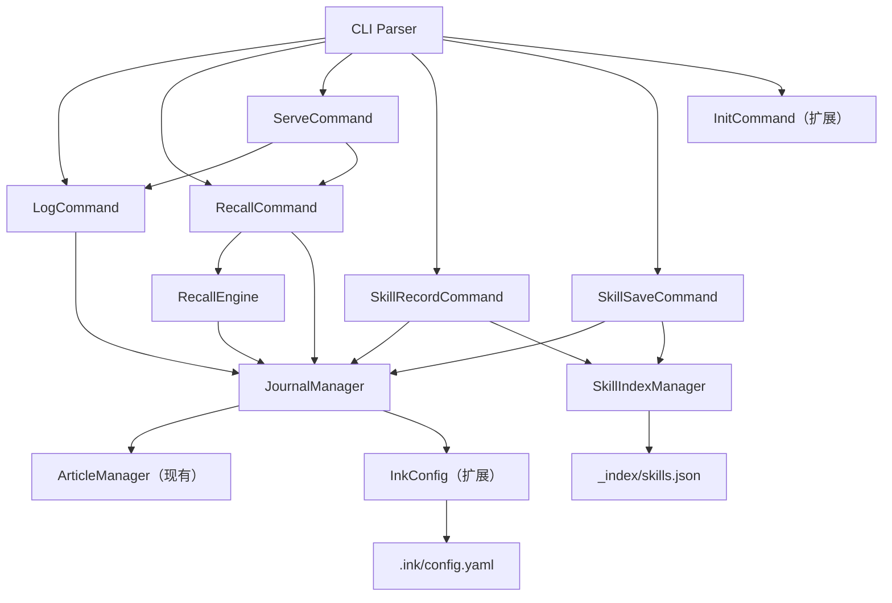

# 设计文档：OpenClaw Agent Mode

## 概述

OpenClaw Agent Mode 是 `ink-blog-core` 的 AI Agent 专用扩展，在 `feature/openclaw-agent` 分支上构建。
它为 OpenClaw（一个 AI Agent）提供两项核心能力：**自动写入日记**（`ink log`）和**检索记忆**（`ink recall`）。

设计遵循现有的 FS-as-DB 哲学：所有数据以本地文件系统为唯一存储，新增 `agent` 模式通过配置与人类博客模式区分，
并可选地通过 HTTP API（`ink serve`）对外暴露能力。

### 设计目标

- **最小侵入**：复用现有 `ArticleManager`、`InkConfig`、`SkillResult`、`CommandExecutor` 等基础设施
- **向后兼容**：`mode: human`（默认）行为完全不变
- **可测试性**：核心逻辑（日记写入、条目解析、检索排序）为纯函数，便于属性测试
- **可扩展性**：HTTP API 层薄，仅做参数转换，不含业务逻辑

---

## 架构

### 整体分层

```
┌─────────────────────────────────────────────────────────┐
│                    CLI / HTTP API 层                     │
│  ink log  │  ink recall  │  ink serve  │  ink skill-*   │
├─────────────────────────────────────────────────────────┤
│                    Agent 命令层                          │
│  LogCommand  │  RecallCommand  │  ServeCommand           │
│  SkillRecordCommand  │  SkillSaveCommand                 │
├─────────────────────────────────────────────────────────┤
│                    Agent 核心服务层                      │
│  JournalManager  │  RecallEngine  │  SkillRegistry       │
├─────────────────────────────────────────────────────────┤
│                    现有基础设施层（不修改）               │
│  ArticleManager  │  InkConfig  │  GitManager             │
│  IndexManager    │  SkillResult │  CommandExecutor        │
└─────────────────────────────────────────────────────────┘
```

### 模块依赖关系



### 新增文件结构

```
ink_core/
├── agent/                          # 新增 agent 子包
│   ├── __init__.py
│   ├── journal.py                  # JournalManager：日记文件 CRUD
│   ├── recall.py                   # RecallEngine：检索与排序
│   ├── skill_index.py              # SkillIndexManager：skills.json 管理
│   └── commands/
│       ├── __init__.py
│       ├── log_command.py          # LogCommand（BuiltinCommand）
│       ├── recall_command.py       # RecallCommand（BuiltinCommand）
│       ├── serve_command.py        # ServeCommand（BuiltinCommand）
│       ├── skill_record_command.py # SkillRecordCommand（BuiltinCommand）
│       └── skill_save_command.py   # SkillSaveCommand（BuiltinCommand）
├── core/
│   ├── config.py                   # 扩展：新增 agent 配置块与 mode 验证
│   └── errors.py                   # 扩展：新增 AgentModeError
└── cli/
    ├── builtin.py                  # 扩展：InitCommand 支持 --mode agent
    └── parser.py                   # 扩展：注册新子命令
```

---

## 组件与接口

### 1. InkConfig 扩展

在现有 `InkConfig` 的 `DEFAULT_CONFIG` 中新增 `mode` 和 `agent` 块：

```python
DEFAULT_CONFIG 新增字段：
{
    "mode": "human",          # "human" | "agent"
    "agent": {
        "agent_name": "OpenClaw",
        "auto_create_daily": True,
        "default_category": "note",
        "disable_human_commands": False,
        "http_api": {
            "enabled": False,
            "port": 4242,
        }
    }
}
```

新增 `validate_mode()` 方法，在 `load()` 后校验 `mode` 字段，非法值抛出 `ConfigError`。

### 2. JournalManager

负责 Daily Journal 文件的创建和追加，是 `LogCommand` 的核心依赖。

```python
class JournalManager:
    def __init__(self, workspace_root: Path, config: InkConfig) -> None: ...

    def get_or_create_journal(self, date: str) -> tuple[Path, bool]:
        """获取或创建指定日期的 Daily Journal。
        返回 (journal_index_path, was_created)。
        """

    def append_entry(self, date: str, category: str, content: str) -> LogEntry:
        """追加一条 Log_Entry 到指定日期的 Daily Journal。
        返回追加的 LogEntry（含时间戳）。
        """

    def parse_entries(self, journal_path: Path) -> list[LogEntry]:
        """解析 Daily Journal 文件，提取所有 LogEntry。"""

    def list_journal_paths(self, since: str | None = None) -> list[Path]:
        """列出所有 Daily Journal 的 index.md 路径，可按日期过滤。"""
```

### 3. RecallEngine

负责跨日记文件的检索与排序，是纯函数式设计（无副作用）。

```python
class RecallEngine:
    def search(
        self,
        entries: list[LogEntry],
        query: str,
        *,
        category: str | None = None,
        since: str | None = None,
        limit: int = 20,
    ) -> list[LogEntry]:
        """对 entries 列表执行过滤、评分、排序，返回 top-limit 结果。"""

    def score_entry(self, entry: LogEntry, query: str) -> int:
        """计算单条 entry 对 query 的相关性分数。
        精确词匹配 > 部分匹配；出现次数越多分越高。
        """
```

### 4. SkillIndexManager

管理 `_index/skills.json` 的读写，支持 upsert 语义。

```python
class SkillIndexManager:
    def __init__(self, workspace_root: Path) -> None: ...

    def upsert(self, skill: SkillRecord) -> None:
        """插入或更新技能记录（按 name 去重）。"""

    def list_all(self) -> list[SkillRecord]: ...
```

### 5. LogCommand

```python
class LogCommand(BuiltinCommand):
    name = "log"

    def run(self, target: str | None, params: dict) -> SkillResult:
        # 1. 检查 mode == agent，否则返回错误
        # 2. 验证 category（若提供）
        # 3. 调用 JournalManager.append_entry()
        # 4. 若 git.auto_commit，触发 Git commit
        # 5. 返回 SkillResult
```

### 6. RecallCommand

```python
class RecallCommand(BuiltinCommand):
    name = "recall"

    def run(self, target: str | None, params: dict) -> SkillResult:
        # 1. 检查 mode == agent
        # 2. 验证 --limit 范围 [1, 500]
        # 3. 收集所有 journal entries（通过 JournalManager）
        # 4. 调用 RecallEngine.search()
        # 5. 序列化为 Recall_Result JSON 输出到 stdout
        # 6. 返回 SkillResult
```

### 7. ServeCommand（HTTP API）

使用 Python 标准库 `http.server` 或轻量级 `flask`（可选依赖）实现。
ServeCommand 本身不含业务逻辑，仅做 HTTP ↔ SkillResult 的转换。

```python
class ServeCommand(BuiltinCommand):
    name = "serve"

    def run(self, target: str | None, params: dict) -> SkillResult:
        # 1. 检查 mode == agent
        # 2. 检查 agent.http_api.enabled
        # 3. 启动 HTTP 服务器（阻塞）
```

HTTP 路由映射：

| HTTP 端点 | 方法 | 对应命令 |
|-----------|------|---------|
| `POST /log` | POST | `LogCommand.run()` |
| `POST /recall` | POST | `RecallCommand.run()` |
| `GET /health` | GET | 返回状态 JSON |

### 8. InitCommand 扩展

在现有 `InitCommand.run()` 中新增对 `--mode agent` 和 `--agent-name` 参数的处理：
- 若 workspace 已初始化，仅更新 `mode` 和 `agent` 字段（deep merge）
- 若 workspace 未初始化，执行标准 init 后追加 agent 配置

---

## 数据模型

### LogEntry

```python
@dataclass
class LogEntry:
    date: str        # YYYY-MM-DD
    time: str        # HH:MM（本地时间）
    category: str    # work | learning | skill-installed | memory | note
    content: str     # 原始内容文本
    source: str      # Daily Journal 的 canonical_id，如 "2026/04/05-journal"
```

### SkillRecord

```python
@dataclass
class SkillRecord:
    name: str
    type: str           # "external" | "custom"
    source: str         # URL（外部）或 "local"（自创）
    version: str        # 可为空字符串
    install_path: str   # 安装路径或 .ink/skills/<name>.md
    installed_at: str   # ISO 8601 时间戳
```

### RecallResult（JSON 输出结构）

```json
{
  "query": "string",
  "total": 0,
  "entries": [
    {
      "date": "YYYY-MM-DD",
      "time": "HH:MM",
      "category": "work",
      "content": "string",
      "source": "YYYY/MM/DD-journal"
    }
  ]
}
```

### Daily Journal 文件格式

路径：`YYYY/MM/DD-journal/index.md`

```markdown
---
title: "YYYY-MM-DD Journal"
date: YYYY-MM-DD
status: draft
tags:
  - journal
  - agent
agent: OpenClaw
---

## Entries

## HH:MM [work]

今天完成了 X 任务。

## HH:MM [learning]

学习了 Y 技术。
```

### `_index/skills.json` 格式

```json
[
  {
    "name": "web-search",
    "type": "external",
    "source": "https://github.com/example/web-search",
    "version": "1.2.0",
    "install_path": "/usr/local/lib/web-search",
    "installed_at": "2026-04-05T10:00:00+08:00"
  },
  {
    "name": "my-custom-skill",
    "type": "custom",
    "source": "local",
    "version": "1.0.0",
    "install_path": ".ink/skills/my-custom-skill.md",
    "installed_at": "2026-04-05T11:00:00+08:00"
  }
]
```

### Agent 模式配置示例（`.ink/config.yaml`）

```yaml
mode: agent

agent:
  agent_name: "OpenClaw"
  auto_create_daily: true
  default_category: note
  disable_human_commands: false
  http_api:
    enabled: true
    port: 4242

git:
  auto_commit: true
```

---

## 正确性属性

*属性（Property）是在系统所有有效执行中都应成立的特征或行为——本质上是对系统应做什么的形式化陈述。属性是人类可读规范与机器可验证正确性保证之间的桥梁。*


### 属性 1：日记写入 round-trip

*对于任意* 非空内容字符串和有效分类，通过 `ink log` 写入后，再通过 `ink recall` 检索，返回的 `content` 字段应等于原始传入内容。

**验证需求：2.1, 2.4, 2.6, 4.10**

---

### 属性 2：Log_Entry 格式正确性

*对于任意* 内容字符串和有效分类，`ink log` 追加到 `index.md` 的文本应严格匹配模式 `\n## HH:MM [<category>]\n\n<content>\n`，其中 `HH:MM` 为本地时间。

**验证需求：2.4, 2.6**

---

### 属性 3：Daily Journal 创建完整性

*对于任意* 日期，当 `ink log` 触发 Daily Journal 创建时，生成的 `index.md` 应包含正确的 YAML frontmatter（含 `title`、`date`、`status`、`tags`、`agent` 字段），且同目录下应存在 `.abstract` 和 `.overview` 文件。

**验证需求：3.1, 3.2, 3.4**

---

### 属性 4：Recall 结果 schema 合规性

*对于任意* 查询字符串（包括空查询），`ink recall` 的输出应是合法 JSON，且严格符合 `{"query": string, "total": int, "entries": [...]}` schema，其中 `total` 等于 `entries` 数组长度。

**验证需求：4.1, 4.2, 4.8**

---

### 属性 5：Recall 分类过滤正确性

*对于任意* 有效分类值 `C`，执行 `ink recall --category C` 返回的所有条目，其 `category` 字段均应等于 `C`。

**验证需求：4.3, 5.3**

---

### 属性 6：Recall 日期过滤正确性

*对于任意* 日期字符串 `D`（格式 `YYYY-MM-DD`），执行 `ink recall --since D` 返回的所有条目，其 `date` 字段均应满足 `date >= D`。

**验证需求：4.4**

---

### 属性 7：Recall limit 约束

*对于任意* 有效 limit 值 `N`（1 ≤ N ≤ 500），执行 `ink recall --limit N` 返回的条目数量应满足 `len(entries) <= N`。

**验证需求：4.5**

---

### 属性 8：无效 limit 被拒绝

*对于任意* 整数 `N`（N < 1 或 N > 500），执行 `ink recall --limit N` 应返回 `success=false`。

**验证需求：4.6**

---

### 属性 9：分类大小写规范化

*对于任意* 有效分类值的任意大小写变体（如 `WORK`、`Work`、`wOrK`），`ink log --category <value>` 应成功执行，且存储的分类值为对应的小写形式。

**验证需求：5.2**

---

### 属性 10：无效分类被拒绝

*对于任意* 不属于 `{work, learning, skill-installed, memory, note}` 的字符串，`ink log --category <value>` 应返回 `success=false`。

**验证需求：2.3**

---

### 属性 11：无效 mode 配置被拒绝

*对于任意* 不属于 `{"human", "agent"}` 的字符串，将其设为 `mode` 值时，`InkConfig.load()` 应抛出 `ConfigError`。

**验证需求：1.6**

---

### 属性 12：agent init 配置写入与保留

*对于任意* 已存在的 workspace 配置（含任意非 mode/agent 字段），执行 `ink init --mode agent --agent-name <name>` 后，配置文件应包含正确的 `mode: agent` 和 `agent` 块，且原有其他字段（如 `site`、`git`）应保持不变。

**验证需求：8.1, 8.3**

---

### 属性 13：技能 upsert 无重复

*对于任意* 技能名称，连续执行两次 `ink skill-record`（或 `ink skill-save`），`_index/skills.json` 中该名称的条目应恰好只有一条（后者覆盖前者）。

**验证需求：9.3**

---

### 属性 14：技能 frontmatter 验证

*对于任意* 缺少 `skill`、`version`、`context_requirement` 中任意一个字段的 Markdown 文件，执行 `ink skill-save` 应返回 `success=false`，且错误消息中应列出缺失的字段名。

**验证需求：9.10**

---

### 属性 15：disable_human_commands 拦截

*对于任意* 人类博客命令（`publish`、`build`、`search`、`analyze`、`rebuild`），当 `mode=agent` 且 `disable_human_commands=true` 时，执行该命令应返回 `success=false`，且消息中包含命令名称。

**验证需求：7.2**

---

## 错误处理

### 错误类型与处理策略

| 错误场景 | 错误类型 | 处理方式 |
|---------|---------|---------|
| `mode` 值非法 | `ConfigError` | 抛出异常，CLI 打印错误并退出 1 |
| 非 agent 模式执行 agent 命令 | `SkillResult(success=False)` | 返回描述性错误消息 |
| 无效分类值 | `SkillResult(success=False)` | 列出有效分类值 |
| `--limit` 超出范围 | `SkillResult(success=False)` | 说明有效范围 [1, 500] |
| 技能文件不存在 | `SkillResult(success=False)` | 显示文件路径 |
| 技能文件 frontmatter 缺失 | `SkillResult(success=False)` | 列出缺失字段 |
| HTTP API 未启用 | `SkillResult(success=False)` | 提示配置方法 |
| HTTP 请求缺少必填字段 | HTTP 400 | JSON 错误体 `{"error": "<field> is required"}` |
| `--source` 缺失（外部技能） | `SkillResult(success=False)` | 提示 `--source` 为必填 |

### 新增错误类型

在 `ink_core/core/errors.py` 中新增：

```python
class AgentModeError(Exception):
    """Command requires agent mode but current mode is different."""
```

---

## 测试策略

### 测试框架

- **单元测试 / 属性测试**：`pytest` + `hypothesis`（已在项目中使用）
- **HTTP 集成测试**：`pytest` + `httpx` 或标准库 `urllib`

### 属性测试配置

每个属性测试使用 `@settings(max_examples=100)` 配置，并通过注释标注对应属性：

```python
# Feature: openclaw-agent-mode, Property 1: 日记写入 round-trip
@given(content=st.text(min_size=1), category=st.sampled_from(VALID_CATEGORIES))
@settings(max_examples=100)
def test_log_recall_roundtrip(content, category): ...
```

### 测试文件组织

```
tests/
├── agent/
│   ├── test_journal_manager.py      # 属性 1, 2, 3
│   ├── test_recall_engine.py        # 属性 4, 5, 6, 7, 8
│   ├── test_log_command.py          # 属性 9, 10
│   ├── test_recall_command.py       # 属性 4-8
│   ├── test_skill_index.py          # 属性 13, 14
│   ├── test_config_agent.py         # 属性 11, 12
│   └── test_human_compat.py         # 属性 15
└── integration/
    └── test_http_api.py             # HTTP API 集成测试（需求 6）
```

### 单元测试覆盖重点

- `JournalManager.parse_entries()`：解析各种格式的 journal 文件
- `RecallEngine.score_entry()`：评分逻辑的边界情况
- `InkConfig` 扩展：mode 验证、agent 块默认值
- `SkillIndexManager.upsert()`：重复名称处理

### 集成测试覆盖重点

- `ink log` → Git commit 触发（需求 2.9）
- `ink skill-save` → Git commit 触发（需求 9.11）
- HTTP API 端点的完整请求/响应周期（需求 6）
- `ArticleManager` 兼容性：journal 路径可被正常读取（需求 3.5）
